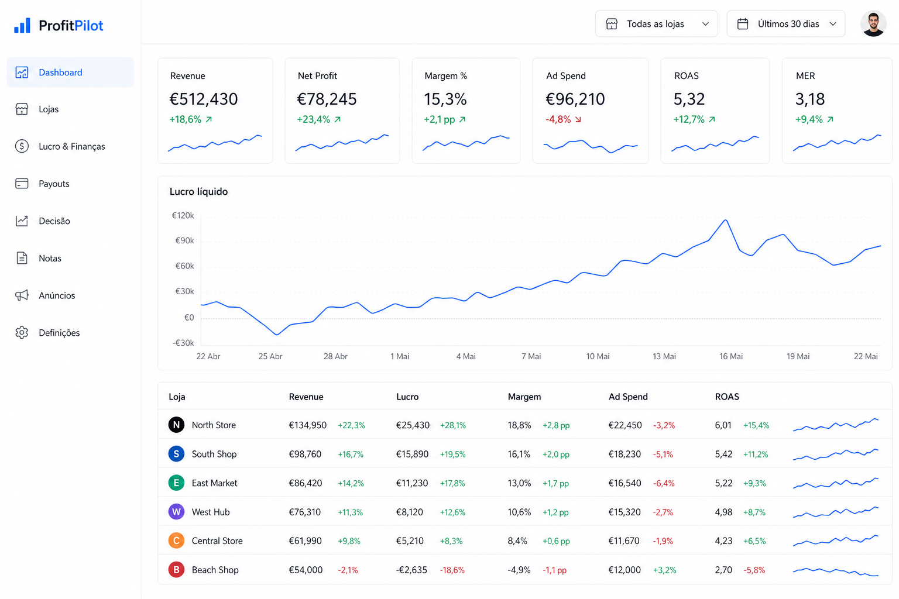
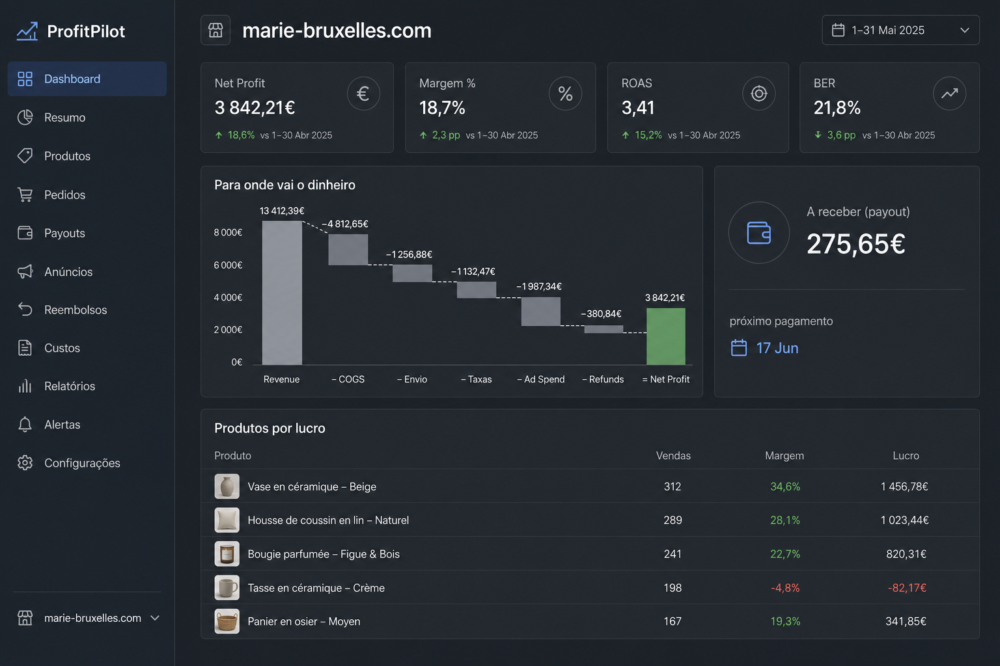
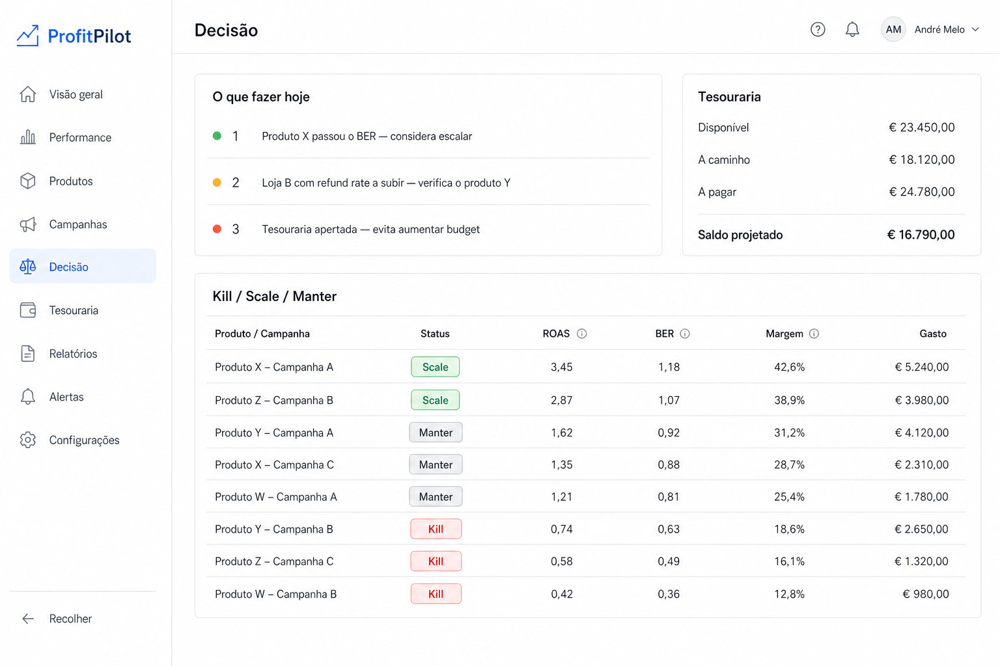
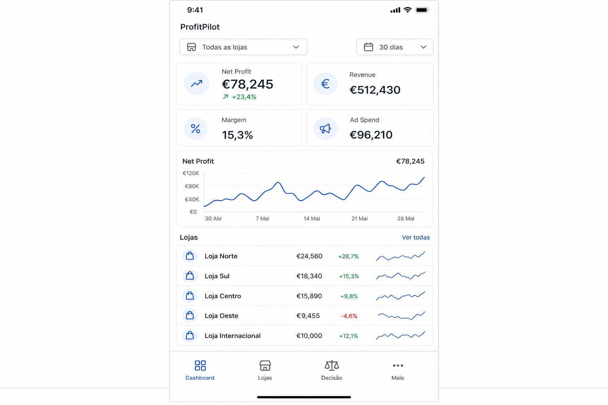

# ProfitPilot

> Dropshipping Analytics Hub — gestão e análise de lucro real de múltiplas lojas.

## Objetivo

Criar uma plataforma centralizada para gestão e análise de **múltiplas lojas de dropshipping em simultâneo**, com:

* **Visão consolidada** — ver todas as lojas ao mesmo tempo num único dashboard, e fazer drill-down loja a loja.
* **Histórico permanente** — guardar todos os dados (mesmo de lojas removidas ou de plataformas que cancelaste), sem depender da retenção limitada da Shopify/WooCommerce.
* **Lucro real (Net Profit)** — não apenas revenue bruto, mas o lucro depois de COGS, envio, taxas de pagamento, ad spend, chargebacks, custos de apps e impostos. **REV** nas métricas = vendas líquidas (Shopify Net sales) de encomendas **já pagas** (`paid`, parcialmente pagas/reembolsadas), usando `currentSubtotalPriceSet` / total actual (reflete edições de encomenda). **Pendentes** (ex. Multibanco à espera) ficam em `/pedidos` mas **não entram** em REV/lucro até pagarem; **expiradas/anuladas** são removidas no sync.

> Alternativa própria ao **Triple Whale** e **Polar Analytics**, focada em dropshipping, com controlo total dos dados.

---

# Requisitos Obrigatórios (não-negociáveis)

> Estas regras aplicam-se a **todo** o desenvolvimento, independentemente do agente/modelo usado no Cursor. Devem ser seguidas do início ao fim, sem exceções.

1. **Web App (PWA)** — é uma aplicação web instalável. Tem de poder ser adicionada ao ecrã inicial de **iPhone, iPad e Android** e funcionar como app, continuando a ser 100% web (sem build nativa).
2. **Responsividade 100%** — todos os ecrãs funcionam e ficam bem em **telemóvel, tablet e desktop**. Mobile-first. Nada pode ficar cortado, sobreposto ou inutilizável em ecrãs pequenos.
3. **UI clean, sem aspeto de IA** — sem emojis na interface, sem gradientes, sem cores neon. Estética sóbria de ferramenta financeira (ver secção "Design e UI").
4. **Segurança em primeiro lugar** — credenciais sempre encriptadas, isolamento total de dados por utilizador (ver secção "Segurança").
5. **Lucro real exato** — todos os custos (COGS, taxas, ads, refunds, chargebacks, apps/subscrições) entram no cálculo. O cálculo de lucro tem testes.
6. **Histórico permanente** — nada de dados se perde; soft delete e snapshots diários.
7. **Este documento (`app.md`) é a fonte de verdade.** Antes de implementar qualquer parte, consultar a secção correspondente. Manter o documento atualizado quando algo mudar.
8. **Terminar o que se começa** — cada funcionalidade é entregue completa (frontend + backend + responsividade + segurança), não pela metade.

---

# Web App / PWA e Responsividade

> Funciona no browser e instala-se no telemóvel como se fosse uma app.

## PWA (instalável)

* **Progressive Web App** com `manifest.json` (nome, ícones, cor, `display: standalone`) e **service worker**.
* **Instalável** no iPhone/iPad (Safari → "Adicionar ao ecrã principal") e Android (Chrome → "Instalar app").
* Abre em **ecrã inteiro** (sem barra do browser), com ícone e splash próprios.
* **Funciona offline** para consulta (cache dos últimos dados vistos); sincroniza quando volta a ligação.
* **Notificações push** (web push) para alertas e resumo diário, quando o dispositivo permite.
* Continua a ser **100% web** — uma única base de código, sem app nativa nem app stores.

## Responsividade (obrigatória em tudo)

* **Mobile-first**: desenhar primeiro para telemóvel, depois escalar para tablet e desktop.
* **Breakpoints** consistentes (Tailwind: `sm`, `md`, `lg`, `xl`). **Breakpoint principal de layout: `lg` (1024px)** — abaixo disso usa barra inferior; a partir de `lg` usa sidebar fixa.
* Layouts adaptáveis: cartões empilham no telemóvel; **tabelas viram cartões até `lg`**; em desktop (`lg+`) tabelas com scroll horizontal quando necessário.
* **Navegação adaptada**: sidebar fixa à esquerda em `lg+`; barra inferior (4 itens + «Mais») em telemóvel e tablet (`< lg`).
* Áreas de toque grandes, fontes legíveis, gráficos que encolhem sem perder leitura.
* **Critério de aceitação**: cada ecrã é testado em larguras de ~375px (telemóvel), ~768px (tablet) e ~1280px+ (desktop) antes de dar como concluído.

---

# Tecnologias

## Frontend

* Next.js (App Router)
* TypeScript
* Tailwind CSS
* Shadcn/UI
* Recharts (ou Tremor para dashboards financeiros)
* TanStack Query (cache servidor 60 s; cliente lê BD a cada **30 s**; sync ads API só **cron Vercel** de **2 em 2 h** ou botão «Actualizar»)
* Zustand (estado global leve)
* **PWA**: `manifest.json` + service worker (ex.: Serwist / next-pwa) para instalar no telemóvel e funcionar offline

## Backend

* Next.js API Routes / Route Handlers
* Node.js
* **BullMQ + Redis** — filas para sincronização periódica e import histórico
* **Zod** — validação de payloads dos webhooks e da API
* **Live sync**: `GET /api/live/stream` (SSE, autenticado) — ver secção «Sincronização em tempo real»

## Base de Dados

* **MongoDB** — dados operacionais (orders, products, customers)
* **Redis** — cache, rate-limiting e filas
* (Opcional) **ClickHouse / TimescaleDB** — métricas agregadas e séries temporais para queries rápidas em grandes volumes

## Integrações externas (essenciais para o lucro real)

* **Shopify Admin API (GraphQL)** — app do Dev Dashboard, ligada por **Client ID + Chave secreta** via client credentials grant (ver "Ligação à Shopify")
* **Meta Ads API** (Facebook/Instagram) — ad spend
* **TikTok Ads API** — ad spend
* **Google Ads API** — ad spend
* **Stripe / PayPal / Shopify Payments** — taxas de transação reais
* **Fornecedores** (AliExpress, CJ Dropshipping, Zendrop) — COGS e custo de envio

## Infraestrutura

* Docker / Docker Compose
* VPS (Hetzner / DigitalOcean)
* Cloudflare (CDN, proxy, WAF)
* Backups automáticos diários da base de dados (regra de ouro do "histórico permanente")

---

# Design e UI

> Aparência profissional de ferramenta financeira séria. Nada de "cara de app feita por IA".

## Princípios

* **Clean e minimalista** — muito espaço em branco, hierarquia clara, foco nos números.
* **Sem emojis** na interface. Ícones consistentes de uma única biblioteca (ex.: Lucide), monocromáticos.
* **Sem gradientes**, sem sombras exageradas, sem cores "neon". Superfícies planas.
* **Paleta sóbria e neutra** — fundo neutro, 1 cor de destaque discreta, verde/vermelho apenas para indicar lucro/prejuízo.
* **Tipografia limpa** (ex.: Inter / Geist), números tabulares alinhados para ler valores rapidamente.
* **Densidade controlada** — tabelas e dashboards densos mas legíveis, estilo painel financeiro (ex.: Linear, Stripe Dashboard).
* **Consistência total** — mesmos espaçamentos, mesmos cantos, mesmos componentes em toda a app.
* **Dark mode e light mode** sóbrios.

## Referência visual canónica (obrigatória)

> Os mockups em `assets/` são a **direção de design aprovada**. A app final tem de ficar **100% alinhada** com esta estética e organização (ver secção "Mockups e Wireframes Detalhados"). Qualquer ecrã novo segue a mesma linguagem visual.

## Design Tokens (valores concretos)

> Resumo abaixo. A **fonte completa e canónica** (cores hex, tipografia, componentes, Tailwind config e variáveis CSS) está em **`design-system.md`** — seguir esse ficheiro a 100%.

* **Tipografia**: Inter (ou Geist). Números **tabulares** (`font-variant-numeric: tabular-nums`). Títulos semibold, corpo regular.
* **Cores (light)**: fundo principal `#F8FAFC`, sidebar/cartões `#FFFFFF` com borda `#E2E8F0`, texto principal `#111827`, texto secundário `#64748B`.
* **Cores (dark)**: fundo `#1C242C`, sidebar `#181F28`, cartão `#22282E`, borda `#2E3844`, texto `#E8EDF2`.
* **Accent** (discreto): azul `#2563EB` (apenas para item ativo, links e seleção).
* **Semânticas**: lucro/positivo verde `#16A34A`; prejuízo/negativo vermelho `#DC2626`; aviso âmbar `#D97706`. Usadas **só** em valores e estados, nunca como decoração.
* **Cantos**: `rounded-lg` (~8px) em cartões e botões.
* **Sombras**: nenhuma ou muito subtil (`shadow-sm`); preferir **borda** a sombra.
* **Espaçamento**: grelha base de 4px; padding de cartão 16–24px; gaps consistentes (16px).
* **Cartões de KPI**: rótulo pequeno em cima, valor grande, variação (verde/vermelho) e sparkline.
* **Tabelas**: cabeçalho leve, linhas com separador subtil, números alinhados à direita, tags de status em pill.
* **Ícones**: Lucide, traço fino, monocromáticos (cor do texto).
* **Sem**: gradientes, neon, sombras pesadas, emojis, ilustrações "cartoon".

## Velocidade (a app tem de ser rápida)

* Tempo de carregamento percetível mínimo: **métricas pré-calculadas** (`DailyMetric` — gráfico de lucro lê snapshots para dias históricos; só hoje/dias em falta agregam orders).
* **Cache servidor** (`unstable_cache`, 60 s) em `/api/metrics/summary` — chave por workspace + loja + período; invalida após sync Shopify e alteração de ad spend manual (`revalidateTag`).
* **Índices MongoDB** compostos em `orders`: `{ storeId, orderDate }` e `{ workspaceId, orderDate }` — agregações do dashboard mais rápidas.
* **Sparklines consolidadas** — uma agregação batch (últimos 7 dias) em vez de N queries por loja.
* **Cache cliente** (TanStack Query 60 s + `placeholderData`) e invalidação SSE targeted.
* **Skeletons** em vez de spinners; nada de ecrãs em branco.
* Paginação e virtualização em tabelas grandes.
* Sem animações desnecessárias; transições subtis e rápidas.

---

# Funcionalidades

## Gestão de Lojas

### Deve permitir

* Adicionar loja
* Editar loja
* Desativar loja (mantém dados, pausa sincronização)
* Reativar loja
* **Arquivar loja** (remove do seletor e das métricas consolidadas; histórico mantém-se — reativa em Definições → Lojas para voltar a contar)
* **Reconfigurar importação** (Definições → Lojas): altera data de início e taxas iniciais, recalcula taxas nas encomendas já importadas, opcionalmente remove orders anteriores à nova data — **sem apagar a loja**
* **Apagar loja permanentemente** (owner/admin): remove loja e todos os dados na BD (orders, ad spend, COGS, notas, payouts, etc.) — confirmação com nome da loja
* **Agrupar lojas** por marca/nicho/país (ex.: "Lojas PT", "Lojas Pet")
* **Definir moeda base** por workspace para consolidar tudo numa única moeda

### Plataformas suportadas

* Shopify
* WooCommerce

Futuro:

* Etsy
* Amazon
* eBay
* TikTok Shop

### Conexão e sincronização

* **Webhooks** para eventos em tempo real (`orders/create`, `orders/updated`, `refunds/create`, `products/update`)
* **Sincronização inicial histórica** ao adicionar uma loja — com opção de escolher o **dia de início** (importar tudo o disponível **ou** apenas a partir de uma data X, ex.: "só desde 01/01/2026")
* **Sincronização incremental** agendada — **Vercel Cron de 2 em 2 horas** (`/api/cron/sync`, `0 */2 * * *`) sincroniza em lote todas as lojas ativas (intervalo mínimo **2 h** por loja, configurável via `GLOBAL_SYNC_INTERVAL_MINUTES`). **Depois da primeira sync**, cada execução só pede o **delta** à Shopify:
  * **Encomendas**: `updated_at` desde `lastSyncAt` (−2 h de margem) — apanha vendas novas **e** refunds/alterações sem reimportar o histórico.
  * **Taxas**: balance transactions e encomendas afetadas só desde o mesmo delta (não percorre todas as orders da loja).
  * **Payouts**: 2 páginas (100 mais recentes) em vez de 6; **COGS Shopify** só para **variantes vendidas** (não o catálogo inteiro).
  * **Snapshots diários**: no máximo 3 dias em falta por execução (30 na primeira sync).
  * Sessões/funil: dias históricos na BD (gzip); só dias em falta ou o dia atual voltam à Shopify.
* **Sync manual** (`Sincronizar agora` em `/lojas`) — em passos via `POST /api/stores/[storeId]/sync` (**50 encomendas** por pedido, `maxDuration` 300 s) com **barra de progresso** e cancelar. **Primeira sync**: importação completa desde `importStartDate`. **Syncs seguintes** (`lastSyncAt` definido): só encomendas **novas/alteradas** (`updated_at` desde última sync), custos só de **variantes vendidas em falta**, payouts recentes, sessões em falta + hoje, e **fase `ad_landings`** (URLs das ads → coleções/produtos Shopify para ROAS por coleção). **Retoma** importação interrompida (mantém cursor/fase). Botão mostra «Atualizar dados» quando já houve sync concluída.
* **Reimportar encomendas** (Definições → Dados da loja) — `POST /api/stores/[storeId]/sync` com `action: start_orders_resync`: apaga encomendas desde `importStartDate`, reimporta tudo da Shopify (`created_at`), recalcula taxas desde essa data e **mantém** COGS por variante, ad spend, sessões, notas e configurações; repõe COGS manuais por encomenda.
* Estado de sincronização visível por loja (última sync, erros, atraso)

### Ligação à Shopify — Client ID + Chave secreta (Client Credentials Grant)

> Método de ligação: app criada no **Shopify Dev Dashboard** ([docs](https://shopify.dev/docs/apps/build/dev-dashboard)). Desde **1 jan 2026** a Shopify deixou de mostrar tokens `shpat_` permanentes; em vez disso usa-se o **client credentials grant** ([docs](https://shopify.dev/docs/apps/build/authentication-authorization/access-tokens/client-credentials-grant)): a app troca **Client ID + Chave secreta** por um access token de curta duração (~24h), diretamente com a loja, sem interação do utilizador. Só funciona em **lojas da própria organização** (o nosso caso).

**Como funciona**

1. Criar uma app no Dev Dashboard (`dev.shopify.com/dashboard`) e configurar os **scopes** (Admin API access scopes) na configuração da app.
2. **Instalar a app na loja** (mesma organização) e, em **Settings → Credenciais**, copiar o **ID de cliente (Client ID)** e a **Chave secreta (Client secret)**.
3. No nosso sistema, ao adicionar uma loja, o utilizador cola: **domínio Shopify** (`xxx.myshopify.com`, ligação API), **URL público** (`minhaloja.com`, dashboard e reports), **Client ID** e **Chave secreta**.
4. O sistema obtém um access token via `POST /admin/oauth/access_token` (`grant_type=client_credentials`), valida com uma query de teste e começa a sincronizar.
5. O token expira ~24h: a app **pede um token novo automaticamente** em cada sincronização (as credenciais ficam guardadas encriptadas; o token não é persistido).

**Scopes (permissões) necessários — só leitura**

* `read_orders` — vendas, reembolsos, descontos (revenue, refunds, AOV, CVR)
* `read_products`, `read_inventory` — produtos e **custo por artigo (cost per item)** para o COGS
* `read_shopify_payments_accounts` — saldo Shopify Payments (`shopifyPaymentsAccount`)
* `read_shopify_payments_payouts` — **obrigatório** para payouts e balance transactions (sem este scope: «Access denied for payouts field»)
* `read_shopify_payments_disputes` — chargebacks
* `read_reports` / `read_analytics` — sessões e métricas de funil (ATC, checkout, CVR), quando disponíveis
* `read_customers` — clientes e LTV

**Acesso à API**

* **Admin API GraphQL** para a maioria das queries (orders, products, `inventoryItem.unitCost`, payouts).
* Header de autenticação: `X-Shopify-Access-Token: <token>`.
* Respeitar **rate limits** (custo de query GraphQL) com filas e backoff.
* O **Client Secret** é usado para validar a **assinatura HMAC** dos webhooks.

**Segurança**

* **Client ID e Chave secreta** guardados **encriptados** (AES-256-GCM), nunca em texto simples nem em logs. O access token (curta duração) não é persistido — é pedido de novo quando necessário.
* Ligação validada na ligação e revalidada periodicamente; alerta se as credenciais ficarem inválidas ou perderem permissões.

### Assistente "Adicionar Loja" (o que a app mostra ao utilizador)

> No ecrã de adicionar loja há um guia passo-a-passo (com texto e ajuda) para a pessoa saber exatamente o que fazer.

**Texto guia apresentado na app:**

> **Como ligar a tua loja Shopify**
> 1. Entra no Shopify Dev Dashboard em `dev.shopify.com/dashboard` e cria uma app.
> 2. Em **Configuration / API access**, ativa os scopes indicados abaixo (inclui `read_shopify_payments_payouts`).
> 3. **Instala a app na tua loja** e, em **Settings → Credenciais**, copia o **ID de cliente** e a **Chave secreta**.
> 4. Se alterares scopes mais tarde, **reinstala a app** na loja para aplicar as novas permissões.
> 5. Cola aqui os 2 valores + o domínio Shopify (`aminhaloja.myshopify.com`) + o URL público (`minhaloja.com`) e clica em **Ligar**.
> 6. Vamos validar o acesso e importar o teu histórico automaticamente.

**Scopes a ativar (a app mostra a lista com botão "copiar"):**

* `read_orders` — vendas, reembolsos e descontos
* `read_products` — produtos
* `read_inventory` — custo por artigo (COGS)
* `read_shopify_payments_accounts` — saldo na Shopify (por pagar)
* `read_shopify_payments_payouts` — histórico de payouts e transações pendentes
* `read_shopify_payments_disputes` — chargebacks
* `read_customers` — clientes e LTV
* `read_reports` / `read_analytics` — sessões e funil (ATC, checkout, CVR)

**Na app:**

* Campos: **Domínio**, **Client ID**, **Chave secreta**, **Data de importação** (obrigatória — desde que dia queres orders/métricas), **Taxas** (% processamento, fixo/encomenda, % taxa de transação — aplicam-se a todas as encomendas desde essa data; calendário `feeSchedule` criado no setup).
* Botão **"Testar ligação"** antes de guardar (feedback verde/vermelho com o motivo do erro).
* Após ligar: barra de progresso do **import histórico** e estado de cada permissão (verde = ok, vermelho = scope em falta com instrução de como corrigir).

---

# Dashboard Consolidado (Multi-loja)

> O coração da app: ver **todas as lojas ao mesmo tempo**.

## Vista global

* Seletor de lojas (todas / grupo / seleção manual)
* Seletor de período com comparação automática
* Conversão de todas as moedas para a **moeda base**
* Cartões de KPI agregados de todas as lojas selecionadas

## Layout da dashboard consolidada

Organização orientada ao lucro (alinhada com o design system — sóbria, sem cores neon):

1. **KPIs principais** (grelha responsiva, até 6 por linha): **Faturamento**, **Net Profit** (card destacado — borda accent, valor maior), **Custos totais**, **Margem %**, **Ad Spend**, **ROAS**.
2. **Gráfico «Lucro líquido» + painel «Repartição de custos»** lado a lado (`lg:grid-cols-3` — gráfico ocupa 2/3, painel 1/3; empilham no telemóvel).
   * O painel mostra Faturamento, cada custo real (custo de produto, envio, taxas, anúncios, despesas operacionais) com barra proporcional e % da receita, **Custos totais** e **Lucro líquido** em destaque. Reembolsos aparecem em rodapé como informativo (já estão na receita líquida).
3. **Metas do mês** (se configuradas) e **tabela comparativa loja a loja**.
4. **Ver mais métricas** (painel expansível): BER, Margem contrib. %, COGS, Envio, Taxas, Refunds, Encomendas, AOV, MER, POAS, etc.

`costBreakdown` no `DashboardSummary` traz os valores brutos + formatados (respeita modo apresentação e moeda base).

## Métricas principais (agregadas)

* Faturamento (vendas líquidas — subtotal após descontos, sem envio/IVA, menos reembolsos)
* **Net Profit (lucro real)** · **Margem de lucro (%)**
* **Custos totais** (produto + envio + taxas + anúncios + despesas operacionais)
* Orders
* AOV (Average Order Value)
* Conversion Rate
* Refunds / Refund Rate
* **Ad Spend total**
* **ROAS / POAS** (Profit on Ad Spend — mais honesto que ROAS para dropshipping)
* **MER** (Marketing Efficiency Ratio = revenue / ad spend total)
* **BER** (Break-even ROAS — no painel «Ver mais»)
* CAC (Customer Acquisition Cost)
* Novos clientes vs recorrentes

## Tabela comparativa loja a loja

Uma tabela onde cada linha é uma loja e as colunas são as métricas-chave (revenue, lucro, margem, ad spend, ROAS), com:

* Ordenação por qualquer coluna (ex.: "qual loja dá mais lucro?")
* Mini-gráfico de tendência (sparkline) por loja
* Destaque das melhores e piores lojas
* Totais no rodapé
* **Modo apresentação** (ícone olho na topbar) — desfoca valores monetários, nomes de lojas/produtos, gráficos e identificadores sensíveis para mostrar o dashboard a terceiros; preferência guardada em `localStorage`.

---

# Lucro Real (Net Profit)
> Esta é a funcionalidade que diferencia a app. Calcular o lucro **verdadeiro**, não só o revenue.

## Fórmula

```
Net Profit =
    Revenue (vendas líquidas)
  − COGS (custo dos produtos)
  − Custos de envio (o que pagas ao fornecedor)
  − Ad Spend (Meta + TikTok + Google)
  − Taxas de pagamento (Stripe/PayPal/Shopify Payments)
  − Chargebacks
  − Descontos / cupões (já refletidos na revenue líquida)
  − Taxas de apps e subscrições (no dia de cobrança)
  − Impostos (IVA/sales tax, se aplicável)
  − Custos fixos (rateados: domínio, ferramentas, salários)
```

## Fontes de cada custo

| Custo | Origem |
|---|---|
| Revenue | Webhooks de orders da plataforma |
| COGS | Custo definido por produto/variante (manual, CSV ou API do fornecedor) |
| Envio | Custo real do fornecedor por order/produto |
| Ad Spend | Meta / TikTok / Google Ads API |
| Taxas de pagamento | Stripe / PayPal API (ou % estimada por gateway) |
| Refunds | Webhook `refund/created` |
| Apps/Subscrições | Custo mensal definido manualmente, rateado por order ou por loja |
| Custos fixos | Definidos manualmente por mês |

## Configuração de custos (COGS)

**Modo no setup da loja** (`cogsMode` + `cogsInputCurrency`):

| Modo | Como preencher | Top produtos na dashboard |
|------|----------------|---------------------------|
| `shopify` (defeito) | Cost per item da Shopify no sync | Por lucro |
| `variant` | Manual / CSV por variante | Por lucro |
| `order` | COGS total por encomenda em `/cogs` | **Por unidades vendidas** |
| `day` | COGS total por dia civil (fuso da loja) em `/cogs` | **Por unidades vendidas** |

* **Moeda de entrada** — EUR ou USD no setup (`cogsInputCurrency`). Valores em USD convertem com taxa do dia (Frankfurter/ECB; moedas fora da ECB, ex. RSD, via API secundária; fallback fixo se tudo falhar).
* **Dashboard sempre em EUR** (moeda base do workspace) — encomendas de lojas Shopify em USD/GBP/etc. guardam `amountsBase` no sync; revenue, COGS, envio e taxas entram convertidos no lucro.
* **Buscar o COGS automaticamente da Shopify** — modo `shopify`: `InventoryItem.unitCost` via Admin GraphQL API.
* Definir/editar **COGS por produto e por variante** manualmente (modo `variant`)
* Importar COGS via **CSV** (modos `shopify` / `variant`)
* **COGS por encomenda** — `manualCogs` na order, convertido para moeda base; lucro usa este valor em vez da soma das linhas.
* **COGS por dia** — coleção `manualCogsDays` (espelho do ad spend manual); um valor por dia com vendas.
* **Taxa alfandegária UE (Win-Win)** — 3 € por encomenda paga em lojas com COGS `shopify` desde **2026-06-26**, soma ao COGS do dia (conta **logo** no report diário / coach). Se a encomenda for **cancelada ou reembolsada sem ter sido enviada**, o sync incremental **corrige** e a taxa deixa de contar; `voided`/`expired` saem da BD. Já enviadas (`fulfilled` / `partially_fulfilled`) mantêm a taxa mesmo com reembolso posterior. O mercado UE vem do **país das sessões** (Definições → «Países das sessões»): com **1 país** UE (ex. `BE`) → todas as encomendas pagas elegíveis; fora UE → nenhuma; vazio (mundo) → fallback por `shippingCountryCode`. Com **2+ países** o automático pode continuar até existir encomenda noutro país de sessões; aí `cogsMode` passa a `day` e a taxa automática **desliga-se** (COGS já gravados nas encomendas mantêm-se). Lojas COGS manual (`variant` / `order` / `day`) **não** incluem esta taxa. Painel informativo na dashboard/Métricas/Notas. Botão «Atualizar países de envio» em Definições só aparece no fallback (país das sessões vazio).
* **COGS histórico** — coleção `cogsHistory` com versões por variante (`effectiveFrom` / `effectiveTo`). O lucro de cada encomenda usa o custo válido na **data da venda**; quando o fornecedor muda o preço, só se ajustam vendas a partir de `effectiveFrom` (não se reescreve o passado antes dessa data).
* **COGS no dia + correcção no sync** — modos `shopify`, `variant` e `order`: o custo de produto **conta logo** no dia em que a encomenda é paga (report diário / coach), mesmo ainda por processar. Se depois for **cancelada ou reembolsada sem ter sido enviada**, o sync incremental (`cancelledAt` / `refunded` + ainda `unfulfilled`) **reverte o COGS** (zera linhas/`amountsBase` e limpa `manualCogs`). Encomendas `voided`/`expired` continuam a ser removidas da BD. A **taxa UE** (3 €) segue a mesma lógica. Modo `day` mantém a lógica própria.
* **Fornecedor externo (ex. Primeflow → Shopify)** — custo/preço entra via `InventoryItem.unitCost` e `variant.price` na Shopify. Quando o fornecedor faz desconto, a app regista `effectiveFrom` com `inventoryItem.updatedAt` / `variant.updatedAt` (quando a Shopify actualizou), não a hora do nosso sync. Cada sync rever variantes **já vendidas** para apanhar alterações tardias; `assimilatePendingCogsForStore` corrige encomendas a partir dessa data.
* **Preço de venda histórico** — coleção `priceHistory` com o mesmo modelo de vigência. Cada linha de encomenda guarda `unitPrice` e `unitCost` no momento da importação; re-syncs não sobrescrevem snapshots já confirmados (>0). O backfill `backfillOrderLinePricesForStore` repõe preços antigos a partir do `originalUnitPriceSet` da Shopify (correção de dados importados antes desta regra).
* **Fallback catálogo (preço e COGS)** — ao importar variantes vendidas da Shopify, se a variante não tiver preço/custo: usa outra variante do mesmo produto ou o preço mínimo do produto (`priceRangeV2`). Nas encomendas, linhas sem preço/custo preenchem-se via resolver (inclui variante irmã). Quando o catálogo muda num sync, `assimilatePendingCogsForStore` / `assimilatePendingPricesForStore` actualizam linhas vendidas que ainda estavam a 0. **Variante** = combinação cor/tamanho na Shopify. Sync incremental: só variantes novas + 1 lote de 50 para rever descontos; importação inicial percorre todas em lotes.
* **Página COGS** — painel conforme o modo: variantes em falta, tabela de encomendas, dias desde importação, ou taxas EU por categoria (modos shopify/variant).
* **Assimilação automática** — só nos modos `shopify` e `variant`; em `order`/`day` o utilizador preenche manualmente.
* **Sync manual/cron** — só o modo `shopify` importa `InventoryItem.unitCost` da Shopify; em `day`/`order`/`variant` o sync salta essa fase (mais rápido).
* **Aviso de COGS em falta** (dashboard / «Gerir custos») — conforme o modo: variantes sem custo (`shopify`/`variant`), encomendas sem `manualCogs` (`order`), ou dias com vendas sem registo (`day`). A contagem respeita o **período seleccionado** (modo `day` já não soma desde a importação). Ao clicar, `/cogs` abre o painel do modo da loja com o que falta em primeiro.

## Visualizações de lucro

* Net Profit ao longo do tempo (gráfico diário na dashboard consolidada)
* **Waterfall do lucro**: Revenue → menos cada custo → Net Profit (mostra para onde vai o dinheiro)
* **P&L em `/financas`** — demonstração de resultados com COGS, envio, taxas, ad spend e reembolsos; avisos de COGS/ad spend em falta.
* Lucro por loja, por produto, por país, por canal de aquisição
* **Profit por order** (margem média por encomenda)
* Breakeven ROAS por produto (a partir de que ROAS o produto deixa de dar prejuízo) — coluna **BER** em `/produtos` e dashboard da loja; exportação CSV em `/produtos`.
* **Vendas por coleção** (`/colecoes-vendas`, por loja) — ranking de coleções Shopify por unidades e receita no período; expandir cada coleção para ver **vendas por dia**; tabela de produtos com a **coleção principal** associada. Catálogo (`ProductCatalog`) sincronizado **sempre** no sync (fase «Coleções Shopify», independente do modo COGS). GraphQL `product.collections`. A coleção principal é a primeira coleção manual da Shopify (exclui handles genéricos como `all`). Export CSV. Destinado a cruzar vendas reais Shopify com campanhas Google Ads sem pausar campanhas automaticamente.
* **ROAS por coleção** (`/colecoes-roas`, por loja) — seletor de datas global (presets incl. **5d** / **7d**, custom, dias avulsos) + atalhos 5/7 na página. Só coleções cujo URL de destino das ads é `/collections/{handle}`. REV = membership Shopify. **ROAS real** = REV ÷ spend. **Dias activos** (coleção e campanha): dias consecutivos com spend > 0; um dia sem gasto → 0. Acordeões **fechados** por defeito. No fundo: **um briefing EN da loja** com todas as coleções juntas (Day X to Y, Ad account, Store, Campaign sem data/#N, rev/spend/ROAS) + botão copiar. Sync URLs na fase `ad_landings` / «Actualizar URLs».

## Pedidos e reembolsos (por loja)

* **`/pedidos`** — lista de encomendas no período selecionado: pedido #, data, estado financeiro, receita, lucro por order (antes de ads) e reembolso. KPIs: volume, receita, AOV e total reembolsado. Tabela desktop + cartões no telemóvel.
* **`/reembolsos`** — encomendas com `refunded > 0`, refund rate (reembolsos / receita do período) e impacto no lucro por order.

---

# Conexão de Contas de Ads (Ad Spend)

> Sincronizar automaticamente o dinheiro gasto em ads para entrar no cálculo do lucro real.

## Como funciona

* Ligar uma **Ad Account**: **Meta (Facebook/Instagram)**, **Google Ads** e **TikTok Ads**.
* A app vai buscar automaticamente o **valor gasto (spend)** por dia, por campanha e por conta.
* Sincronização diária automática + opção de **refresh manual** a qualquer momento.
* **Regra de sync**: em cada sync periódico, o gasto de **hoje** é **substituído** pelo valor fresco das APIs (inclui **fees** da conta API) — **nunca somado** em cima do que já está na BD; **ontem e dias anteriores só ficam fechados** quando foram gravados **após 00:00** no fuso da loja (1.º sync do dia seguinte com gasto + campanhas). Sync intraday no mesmo dia civil fica **Parcial** e é re-pedido automaticamente. Backfill **incremental** (`ad-metrics-cursor` + `ad-spend-complete`): só pede à Google/Meta dias em **lacuna**, **hoje**, ou **parciais**; dias API **fechados** não voltam à API (excepto refresh de conversões Google nos últimos 7 dias). Com **Google Ads** ligado, re-sincroniza **só conversões/ROAS** dos últimos **7 dias** (janela do kill). **Leitura da BD** a cada **30 s** na dashboard e em `/anuncios`. **Sync API automático** só via **cron Vercel** `/api/cron/ads-sync` (**de 2 em 2 h**, `0 */2 * * *`, paralelo ao cron Shopify) — **não** corre ao abrir a app nem no sync Shopify. Cada ciclo: **hoje** + **ontem** se incompleto + até **14 dias** parciais/em falta por loja; **gasto e campanhas** (`ad_campaign_days`) no mesmo pedido. Botão **«Actualizar»** em `/anuncios` força backfill completo (até 45 dias, parciais incluídos). Se quota esgotada, cron salta até o manual ter sucesso. O manual preenche dias em falta e plataformas **sem** conta API; **hoje**, plataformas com API ligada não se preenchem à mão.
* **Ad spend manual** (`/anuncios`) — se não houver contas ligadas ou o sync falhar, preenches o gasto **por dia, loja e plataforma** (Meta, Google, TikTok) em USD, EUR ou GBP. Cada plataforma tem gasto em ads, fee fixa de agência e fee % sobre o gasto (varia por dia). Dias em falta contam **desde a `importStartDate` da loja** (escolhida no setup) até ontem. Converte automaticamente para a **moeda base** do workspace com a taxa do dia. A página **actualiza-se automaticamente** (leitura BD 30 s) — sync API só cron ou botão. Se **dois utilizadores guardarem o mesmo dia ao mesmo tempo**, prevalece o **primeiro** (optimistic locking com `updatedAt`); o segundo vê aviso e a lista actualiza-se.
* **UI por loja** (`/anuncios?store=…`) — 4 KPIs no topo (dias em falta, ontem, contas API, moeda) + **tabs**: **Gasto manual** (formulário do dia), **Contas API** (lista ligada + Google/Meta/TikTok), **Campanhas** (KPIs + tabela — **mesmo período do selector do topo**; dias passados só BD, API só em «Hoje»), **Histórico** (calendário diário). Sem loja seleccionada: tabela resumo «dias em falta por loja».

## Ligação Meta Ads (Facebook/Instagram)

> Usa a **Meta Marketing API** ([Insights](https://developers.facebook.com/docs/marketing-api/insights)) para ler o spend.

1. Criar uma app no **Meta for Developers** (`developers.facebook.com`), tipo **Business**.
2. Pedir a permissão **`ads_read`** (e `business_management` se gerires várias contas via Business Manager).
3. Obter um **System User token** do Business Manager (recomendado para servidor) com acesso às ad accounts.
4. Em `/anuncios` → tab **Contas API**: colar o token → **Procurar contas** (`GET /me/adaccounts`) → escolher `act_<ID>` → a app valida com `GET /act_<ID>` antes de guardar (credenciais encriptadas AES-256-GCM).
5. O spend vem de **`GET /act_<AD_ACCOUNT_ID>/insights`** com `fields=spend,account_currency`, `level=account`, `time_range` do dia (fuso da loja). API Graph **v25.0** por defeito.

> **OAuth completo** («Ligar Meta» com redirect) — fase seguinte; o fluxo actual segue a documentação oficial para tokens de servidor (System User).

## Ligação Google Ads

> Usa a **Google Ads API** ([docs](https://developers.google.com/google-ads/api/rest/auth)). Precisa de credenciais OAuth, **developer token** e o **customer ID**.

1. Criar um projeto no **Google Cloud Console** e gerar **Client ID + Client Secret** (OAuth 2.0), scopes `adwords` + `userinfo.email` + `openid` (a app pede os três no login).
2. Obter um **developer token** no **Centro da API** de qualquer conta Google Ads a que tenhas acesso — **não é obrigatório MCC**; uma conta de ads normal chega (modo teste para começar). URL: `ads.google.com/aw/apicenter`.
3. Redirect URI: `GOOGLE_ADS_OAUTH_REDIRECT_URI` → `/api/oauth/google/callback`.
4. **Definições → Google Ads** — OAuth **uma vez por Gmail** (workspace).
5. Em cada loja (`/anuncios` → tab **Contas API**) — escolher Gmail + **Customer ID** para sync opcional. **Gasto manual** (tab homónima) funciona sempre sem API.
6. O gasto vem em **USD** (moeda da conta) e converte para a moeda base do workspace. Query **GAQL** ao `GoogleAdsService.search` (`metrics.cost_micros` ÷ 1.000.000).
7. **Fees na conta API** — fee fixa extra + % agência; aplicam-se em cada sync automático.
8. **Trocar conta** — ao ligar outra conta Google na mesma loja, a anterior é desligada; o **histórico de gasto** (`manualAdSpend`) mantém-se.

> Nota: `metrics.cost_micros` vem em **micros** (1.000.000 micros = 1 unidade de moeda).

## Ligação TikTok Ads

* App no **TikTok for Business / Marketing API**, permissão de leitura de relatórios.
* OAuth para obter access token; spend via endpoint de **reporting** por dia/campanha.

## Assistente "Ligar conta de ads" (o que a app mostra)

* Botões **"Ligar Meta"**, **"Ligar Google Ads"**, **"Ligar TikTok"** com guia passo-a-passo.
* Após autorizar, **lista as ad accounts disponíveis** para a pessoa escolher quais associar à **loja actual**.
* **OAuth por loja** — cada loja pode usar um email Google/Meta diferente; o token fica guardado só nessa loja (cookies OAuth temporários também são por `storeId`).
* **Testar ligação** + estado (token válido, último sync, erros) e **reautenticação com 1 clique** quando expira.

## Várias contas por loja
* Uma loja pode ter **mais do que uma conta de ads ligada ao mesmo tempo** (ex.: uma conta Meta **e** uma conta Google).
* Podes ligar **múltiplas contas da mesma plataforma** (ex.: 2 ad accounts Meta para a mesma loja).
* Cada conta de ads é **associada a uma loja**; tokens e credenciais **não são partilhados** entre lojas.
* Vista do ad spend **por plataforma** (quanto foi Meta vs Google vs TikTok) e **somado** no total da loja.

## Dados recolhidos por conta

* Spend (gasto)
* Impressões, cliques, CPM, CPC, CTR
* Conversões / compras reportadas pela plataforma (para comparar com as orders reais)
* Moeda da conta (convertida para a moeda base)

## Estado da ligação

* Última sincronização, erros de token expirado, reautenticação com 1 clique.
* Alerta se uma conta deixar de sincronizar (para não ficares sem dados de spend e o lucro ficar errado).

---

# BER — Break-Even ROAS (por loja e por produto)
> O número mais importante para decidir se podes escalar: a partir de que ROAS deixas de ter prejuízo.

## O que é

O **BER (Break-Even ROAS)** é o ROAS mínimo a que precisas de vender para **não perder dinheiro** depois de pagar produto, envio e taxas. Acima do BER tens lucro; abaixo, prejuízo.

## Fórmula

```
Margem de contribuição (%) =
   (Preço de venda − COGS − Envio − Taxas de pagamento) / Preço de venda

BER (Break-Even ROAS) = 1 / Margem de contribuição

Exemplo:
   Produto vendido a 40€, com 15€ de custos (COGS+envio+taxas)
   Margem = (40 − 15) / 40 = 0,625 (62,5%)
   BER = 1 / 0,625 = 1,6
   → Precisas de ROAS ≥ 1,6 para teres lucro.
```

## Onde aparece

* **BER da loja** (médio ponderado por vendas) vs **ROAS real** atual — semáforo verde/vermelho.
* **BER por produto** — saber que produtos aguentam escalar e quais não.
* Alerta automático quando o **ROAS real cai abaixo do BER** (estás a perder dinheiro agora).
* Usado nas decisões de "**dei scale / não dei scale**" registadas nas notas diárias.

---

# Dashboard por Loja

Cada loja deve ter:

* A mesma linguagem visual da **Dashboard Consolidada**: KPIs principais em grelha responsiva, `Net Profit` destacado, cards sóbrios com borda e sem fundos coloridos.
* KPIs principais: **Faturamento**, **Net Profit**, **Custos totais**, **Margem %**, **Ad Spend** e **ROAS**.
* Painel «Ver mais métricas» com BER, POAS, MER, COGS, envio, taxas, encomendas, AOV, funil Shopify e métricas de ads.
* Grid financeiro principal sempre visível: **Waterfall «Para onde vai o dinheiro»** à esquerda e, à direita, **Repartição de custos** + **A receber (payout)**.
* O waterfall mostra a passagem de faturamento/custos até Net Profit; a repartição de custos mostra o peso de cada custo na receita.
* **Top sellers / produtos mais vendidos** (por revenue **e** por lucro) — com seletor de período (ver secção dedicada)
* Produtos sem vendas (candidatos a remover)
* **Produtos que vendem mas dão prejuízo** (margem negativa)
* Mapa/lista de vendas por país
* Novos clientes vs recorrentes, LTV médio
* Payouts e saldo a receber: página **/payouts** e **/tesouraria** (não na dashboard da loja).

---

# Top Sellers e Análise de Produtos (por período)

> Ver os produtos que mais vendem/lucram em **qualquer intervalo de tempo**, em qualquer loja, e comparar.

## Períodos disponíveis

* **Hoje** e **ontem**
* **Esta semana** / últimos 7 dias
* **Este mês** / últimos 30 dias
* **Últimos 3 meses** (trimestre)
* **Este ano** / últimos 12 meses
* **Período personalizado** (escolher datas)
* Cada período mostra a **comparação com o anterior** (subiu/desceu).

### Fuso horário dos dias (timezone)

* Os dias (**Hoje**, **Ontem**, intervalos) são contabilizados no **fuso da loja** (`ianaTimezone`), alinhado com o admin da Shopify. Os limites de cada dia e o `$match` das orders (`orderDateMatchInTimezone`) usam esse fuso — nunca o fuso do servidor.
* **Vista por loja**: usa o fuso dessa loja.
* **Vista consolidada** (todas as lojas): usa o **fuso predominante** das lojas acessíveis (`dominantStoreTimezone`, fallback `Europe/Brussels`). É **determinístico** — não depende de onde o servidor corre (corrige desalinhamentos em produção UTC).
* O fuso vem automaticamente da Shopify (`timezoneSource: shopify`). Se a loja Shopify estiver num fuso diferente do teu (ex. loja em `Europe/Brussels` UTC+2 e tu em Portugal UTC+1), perto da meia-noite a venda «de hoje» pode cair no dia seguinte. Resolve-se em **Definições → Lojas → Fuso horário dos dias**, definindo um override manual (ex. `Europe/Lisbon`); aí `timezoneSource` passa a `manual` e deixa de ser sobrescrito pelo sync.

## O que mostra

* Ranking de produtos por **unidades**, por **revenue** e por **lucro** (alternável).
* Tendência de cada produto (sparkline) e variação vs período anterior.
* **Novos best-sellers** (entraram no top) e **quedas** (saíram do top).
* Filtrar por loja, por coleção e por país.
* **Top sellers consolidado multi-loja** (os melhores produtos somando todas as lojas).

## Disponível por loja ativa **e arquivada**

* Como os dados são guardados permanentemente, os top sellers continuam acessíveis **mesmo depois de arquivar a loja** — podes ver os melhores produtos de uma loja morta de há meses.

---

# Stock e Reposição

> Não deixar um best-seller ir a zero (perda de vendas) nem ficar com capital preso.

* **Valor de stock** atual (a custo de COGS) por loja e total — quanto tens "preso" em inventário.
* **Alertas de stock baixo / esgotado** com base no ritmo de vendas dos últimos dias.
* **Lead time do fornecedor** por produto — quando deves reencomendar para não romper stock.
* **Dias de stock restantes** ("a este ritmo, acaba em ~5 dias").
* Cruzamento com os **top sellers**: priorizar reposição dos produtos que mais lucro dão.

---

# Notas Diárias (Diário de Operação)
> Registar o que fizeste a cada dia, para depois cruzares com os resultados ("o que mudei no dia em que as vendas dispararam?").

## Cada nota pode ter

* **Data** e **loja** (ou nota global do workspace)
* **Dei scale / Não dei scale** (toggle) — e quanto subiste o budget
* **Mudanças feitas**: novo criativo, mudança de preço, novo produto, mudei público, pausei campanha, mudei oferta, etc. (tags rápidas + texto livre)
* **Texto livre** para observações
* **Humor/estado** do dia (opcional: bom / mau / neutro)
* **Anexos** (print de criativo, screenshot do gestor de anúncios)

## Como aparece

* **Marcadores nos gráficos** — cada nota aparece como um pin na timeline do revenue/lucro, para veres o impacto de cada decisão.
* **Timeline / diário** filtrável por loja e por tipo de mudança (ex.: ver só os dias em que "dei scale").
* Cruzamento automático: "Nos dias em que deste scale, o lucro médio foi X vs Y nos outros dias."
* Lembrete diário opcional para escreveres a nota do dia.

## Consultar mais tarde (histórico de notas)

> Tudo o que escreveste fica guardado para sempre e é fácil de reencontrar.

* **Arquivo permanente** de todas as notas (nunca se apagam; guardadas no histórico permanente).
* **Pesquisa por texto** (procurar uma palavra em todas as notas).
* **Filtros**: por loja, por data/período, por tag de mudança, só "dei scale", etc.
* **Vista de calendário** — ver de relance em que dias houve notas.
* **Clicar num ponto do gráfico** abre a(s) nota(s) desse dia.
* Notas continuam acessíveis **mesmo depois de arquivar a loja**.
* Exportáveis (CSV) junto com as métricas.

---

# Relatório Diário (Daily Report) Automático

> Gerar, para um dia e uma loja, um relatório com os dados já preenchidos automaticamente — pronto a copiar/exportar.

**Estado (implementado):** painel «Resumo» em `/notas`, `/metricas` (loja seleccionada) e na **Dashboard consolidada** (todas as lojas). Ontem por defeito, `?date=YYYY-MM-DD` opcional, com botão copiar. Métricas automáticas: REV, REFUNDS, ADSPEND, DESPESAS, PROFIT (aviso COGS), funil ATC/checkout/CVR, **CPC/CTR/CPM** (totais ads do dia, BD ou `apiSnapshot`). Do lado dos ads no resumo copiado: **MELHOR CAMPANHA** (`apiSnapshot.bestCampaign`) — sem lista de campanhas nem bloco OBS da API. **PRODUTO BEST-SELLER** vem do top produto do dia (unidades/lucro conforme `cogsMode`); se não houver vendas, usa o campo manual da nota. Campos manuais (produtos/coleções testadas, OBS escrita à mão, dificuldades, scale) vêm da **nota diária** (`reportFields`). O texto copiado **só inclui campos preenchidos** (sem linhas vazias nem `—`). Exportação **TXT** e **PDF** (`?format=txt|pdf`) + cartão visual com print.

**Diário ou semanal (toggle):** o painel «Resumo» tem dois modos. O **diário** gera para o dia escolhido (com campos manuais da nota). O **semanal** (`?period=week`) agrega os **7 dias até à data** escolhida (REV, refunds, ad spend, despesas, profit somados; funil e CPC/CTR/CPM recalculados sobre os totais da semana) — cabeçalho `SEMANA: dd/mm – dd/mm`. Em ambos, na vista consolidada/todas as lojas gera **um bloco por loja** (vista de texto por defeito) e por loja mostra também o cartão visual.

## Exemplo do template gerado

```
DIA: 13/06/2026
LOJA: https://marie-bruxelles.com/
REV: 275,65
REFUNDS: 0€
ADSPEND: 12,35
PROFIT: 198,40   (com aviso se COGS em falta no dia)
ATC %: 10,16%
REACHED CHECKOUT %: 6,77%
CVR %: 5,08%
CPC: $0.24
CTR: 5.46%
CPM: US$ 13,01
Produtos testados: 0
Coleções testadas: 1
Quais coleções já testadas: 1
Qual a próxima coleção a testar: sandale
Coleção best-seller: 0
OBS: 6º dia de loja
Principais dificuldades: 0
```

## De onde vem cada campo

| Campo | Origem (automático) |
|---|---|
| DIA | Dia selecionado |
| LOJA | URL público da loja (`displayUrl`, ex. `minhaloja.com`) |
| REV | Vendas líquidas do dia (subtotal após descontos − reembolsos) — **só encomendas pagas** |
| COGS | Custo dos produtos vendidos no dia (cost per item × unidades) |
| REFUNDS | Reembolsos do dia (informativo — já reflectidos na REV) |
| ADSPEND | Valor **só** quando registado em Anúncios (`manualAdSpend`); dias por preencher mostram `—` e **não** entram no lucro |
| PROFIT | Net Profit = REV − COGS − envio − taxas − ad spend (quando registado); aviso se faltar COGS em produtos vendidos nesse dia |
| SESSÕES | ShopifyQL (`read_reports`), filtradas pelos **países das sessões** (`analyticsSessionCountries`; vazio = mundo); com 2+ países a dashboard **soma**; o report **separa** ATC/CVR por país |
| ATC % | `sessões com add to cart / sessões` — mesma origem e **mesmo filtro de país(es)** que SESSÕES |
| REACHED CHECKOUT % | `sessões que chegaram ao checkout / sessões` — mesma origem e **mesmo filtro de país(es)** |
| CVR % | `sessões que concluíram checkout / sessões` — mesma origem e **mesmo filtro de país(es)** |
| CPC, CTR, CPM | Métricas das contas de ads ligadas |
| Produtos/Coleções testadas, próxima coleção, best-seller, OBS, dificuldades | **Campos da nota diária** (preenchidos por ti) |

> **Funil (sessões, ATC %, checkout %, CVR %):** vêm da Shopify (ShopifyQL via Admin GraphQL **2025-10+**, scope `read_reports`), filtradas pelos **países das sessões** em Definições (lista ISO; vazio = mundo). Com **1 país** o report mantém `ATC %` / `CVR %` como antes; com **2+ países** o report **separa por país** (`ATC % BE: …`, `CVR % FR: …`). Os dados ficam na BD em blobs mensais gzip (`session_metrics_months`, chave `countryKey` ISO) — um sync por país. Dashboard / KPIs somam os países seleccionados (label «Sessões: Bélgica, França»). **2+ países:** o COGS automático continua até à **data da 1ª encomenda** noutro país da lista (`cogsDayFromKey`); **a partir desse dia** `cogsMode` = `day` (manual). Dias anteriores mantêm o COGS automático já nas orders. Mudança de países em Definições apaga o cache afectado e dispara re-sync. `sessionMetricsQueryVersion` na loja força re-sync quando a query ShopifyQL muda. REV, REFUNDS, PROFIT e ADSPEND **não** usam este filtro — vêm das orders/ad spend da loja. CPC/CTR/CPM vêm das contas de ads.

## Separação por plataforma (Google vs Facebook)

> Se tiveres Meta **e** Google ligados, as métricas de ads aparecem separadas por plataforma.

```
ADSPEND total: 12,35  (Meta 8,10 | Google 4,25)

— META —
CPC: $0.24   CTR: 5.46%   CPM: US$ 13,01

— GOOGLE —
CPC: $0.31   CTR: 3.10%   CPM: US$ 9,80
```

* Cada plataforma tem o seu bloco de CPC/CTR/CPM/spend.
* Há também uma linha **combinada** (todas as plataformas juntas) para visão geral.

## Várias campanhas: Média vs Total (full)

> Com várias campanhas ativas, podes escolher como ver as métricas.

* **Total (full)** — recomendado: agrega tudo de forma correta (ponderada).
  * `CPC = spend total / cliques totais`
  * `CPM = spend total / impressões totais × 1000`
  * `CTR = cliques totais / impressões totais`
* **Média por campanha** — média simples dos valores de cada campanha (útil para ver o "comportamento médio" de uma campanha).
* **Toggle** no relatório para alternar entre os dois modos, e opção de **detalhar campanha a campanha** (lista com o valor de cada uma).

## Exportar (este género de texto, por cada loja)

> Gera exatamente um bloco de texto como o exemplo acima, **um por loja**.

* **Um relatório por loja**: ao exportar várias lojas de uma vez, sai **um bloco de texto separado para cada loja** (cada um começa com `DIA:` e `LOJA:`).
* Opções de saída:
  * **Copiar para a área de transferência** (texto pronto a colar).
  * **TXT** — um ficheiro por loja, ou um ficheiro único com todas as lojas separadas.
  * **PDF** ou **imagem** (para enviar/guardar).
* **Template editável** — escolher que campos aparecem, a ordem e os rótulos (ex.: manter "REV", "ADSPEND", "ATC %" tal como usas).
* **Geração automática** ao fim do dia, com **envio** opcional por email / Telegram / Discord (um por loja).
* Selecionar **uma loja, várias ou todas**, e **qualquer dia passado** (usa o histórico permanente).
* Campos automáticos (REV, REFUNDS, ADSPEND, PROFIT, ATC%, CVR, CPC/CTR/CPM...) + campos manuais da nota (produtos/coleções testadas, OBS, dificuldades).

### Exemplo de saída para 2 lojas

```
DIA: 13/06/2026
LOJA: https://marie-bruxelles.com/
REV: 275,65
...
Principais dificuldades: 0

DIA: 13/06/2026
LOJA: https://outra-loja.com/
REV: 540,20
...
Principais dificuldades: 0
```

## Relatório visual (cartão em popup, para print)

> Além do texto, um botão **"Report"** em cada loja abre um **popup/modal** com o relatório em formato visual — pronto para tirar print ou fazer **Download** (imagem/PDF). Referência de estilo: `assets/ref-daily-report-card.png`.

**Como funciona:**

* Clicar em **"Report"** (na linha da loja ou no dashboard da loja) abre o popup desse dia.
* O cartão segue o **design system** (clean, flat, sem gradientes): cabeçalho com **logótipo + utilizador + nome da loja + data**, e um botão **Download** no canto.
* **Cartões de KPI** no topo com os teus dados: pode mostrar tanto os de marketing (Spend, Revenue, ROAS, Impressões, Cliques, CTR) como os do teu template (REV, REFUNDS, ADSPEND, PROFIT, ATC%, Reached Checkout%, CVR%, CPC, CTR, CPM).
* **Gráfico "Performance por hora"** (spend/revenue ao longo do dia) — útil para ver os picos.
* **Secção de notas** com os campos manuais (produtos/coleções testadas, próxima coleção, best-seller, OBS, dificuldades).
* **Marca de geração** ("Gerado a 14 Jun, 01:00") no rodapé.

**Exportar o cartão:**

* **Download como imagem (PNG)** ou **PDF** — ideal para print/partilha.
* **Copiar imagem** para colar diretamente.
* **Um cartão por loja** (gerar em lote para todas as lojas do dia).
* Selecionar **qualquer dia** (histórico permanente).

**Dois modos de exportação do relatório diário (à escolha):**

1. **Texto** (o template `DIA / LOJA / REV / ...`) — copiar/TXT.
2. **Cartão visual** (popup) — print / PNG / PDF.

---

# Multi-utilizador, Equipas e Acessos

> Cada utilizador tem os seus próprios dados isolados, e pode partilhar lojas específicas com outras pessoas (só leitura ou para gerir em conjunto).

## Vários workspaces por utilizador (e troca de workspace)

> Uma pessoa pode ter **vários workspaces** e **escolher qual está a ver** a qualquer momento. Um workspace é um "espaço" que agrupa lojas — pode ser para as **tuas próprias** lojas, ou para **acompanhar as lojas de outra pessoa**.

* **Ao criar conta**, é criado automaticamente o **primeiro workspace** (ex.: "As minhas lojas") — para as tuas lojas.
* Podes **criar mais workspaces** com o nome que quiseres (ex.: "Cliente X", "Agência", "Projeto da Maria"), para separar contextos.
* **Gerir workspaces** (Definições → «Os teus workspaces» ou link no seletor): **renomear**, **criar** e **apagar** os workspaces de que és **proprietário**. Sem lojas → apaga de imediato. Com lojas → confirmação dupla (checkbox + escrever o nome). Não podes apagar o único workspace a que tens acesso.
* **Seletor de workspace** (workspace switcher) no topo da app: trocas de workspace e **tudo muda** para esse contexto — lojas, dashboard, payouts, tesouraria, notas. Os dados de cada workspace **nunca se misturam** na edição/configuração.
* **Vista portfolio** (seletor «Vista de métricas» no topo, só se tiveres 2+ workspaces): escolhe **todos os workspaces** ou **2+ específicos** e vê no **Dashboard** KPIs agregados, gráfico de lucro total e **tabela comparativa** (revenue, lucro, margem, ad spend, ROAS) com destaque ao workspace mais rentável. Valores convertidos para a moeda base do workspace activo. O filtro por loja fica indisponível nesta vista.
* Cada workspace tem o **seu seletor de lojas** (consolidado vs uma loja), independente dos outros.
* A **faturação/plano** é por workspace (cada workspace tem o seu plano), o que encaixa no modelo SaaS — um workspace de agência pode ter um plano superior.

### Convites e a que workspace ficam associados

> Quando alguém te convida para ver/editar **X lojas** do workspace dele, **tu escolhes a que workspace teu queres associar esse acesso** — ou usas um workspace dedicado só para isso.

* Um **convite** liga a **tua conta (user)** a um **workspace de outra pessoa** com um papel e um conjunto de lojas (ver `memberships`).
* No teu seletor de workspace passam a aparecer **dois tipos**:
  * **Workspaces teus** (és Owner) — as tuas lojas.
  * **Workspaces partilhados contigo** (foste convidado) — as lojas de alguém, com o papel/lojas que te deram.
* Ou seja: podes ter um workspace **só para acompanhar as lojas de um cliente/amigo** e outro **para as tuas**, e alternar entre eles com um clique.
* Ao aceitar um convite, escolhes como o queres ver: como **workspace partilhado próprio** (aparece com o nome que o dono definiu) — o acesso é sempre limitado às lojas e ao papel que te atribuíram.
* O contrário também vale: quando **tu** convidas alguém para o **teu** workspace, essa pessoa associa o acesso ao espaço dela; tu continuas dono das lojas e podes alterar papel/lojas ou revogar a qualquer momento.

> Modelo de dados: **users ⇄ memberships ⇄ workspaces** (N:N). Um user tem N memberships; cada membership = (userId, workspaceId, papel, lojas permitidas). O workspace ativo guarda-se na sessão/preferências do user.

## Isolamento de dados por utilizador (multi-tenant)

* Cada conta tem o seu **workspace** próprio; os dados **nunca se misturam** entre utilizadores.
* Todos os documentos (orders, products, ads, payouts, notas...) têm `workspaceId` e **todas as queries são obrigatoriamente filtradas por workspace** (isolamento lógico forçado no backend).
* **Estratégia de isolamento** (a escolher na implementação):
  * **Base de dados / schema por utilizador** — cada cliente tem a sua própria BD ("a sua própria bd sem misturar"), isolamento físico máximo. Ideal para clientes que exigem separação total.
  * **Isolamento lógico** com `workspaceId` em todos os documentos + verificação em cada pedido — mais simples de escalar.
  * Modelo recomendado: **híbrido** — isolamento lógico por defeito, com opção de **BD dedicada** para planos superiores/agências.
* Encriptação e backups separados por tenant; um utilizador nunca consegue, por nenhuma via, ver dados de outro.

## Papéis (roles)

| Papel | Pode fazer |
|---|---|
| **Owner** | Tudo: faturação, **gerir membros** (só o owner altera/remove acessos), ligar/remover lojas e contas de ads |
| **Admin / Gestor** | Gerir lojas, custos, notas e configurações (sem faturação nem gerir membros) |
| **Editor** | Editar dados operacionais (COGS, notas) das lojas a que tem acesso |
| **Viewer (só leitura)** | Apenas **visualizar** os dashboards das lojas autorizadas |

## Acessos só de leitura (com lojas à escolha)

> Criar credenciais de acesso só para alguém **ver** os dados, e escolheres exatamente que lojas essa pessoa vê.

* Criar um utilizador **Viewer** e **selecionar quais as lojas** que ele pode ver (acesso por loja, não tudo).
* O Viewer **não pode editar nada** nem ver lojas fora da sua lista.
* Pode-se limitar ainda mais o que vê (ex.: esconder lucro/custos e mostrar só revenue) — **permissões por tipo de dado**, opcional.
* **Acesso temporário** com data de expiração e **revogação a qualquer momento**.
* Alternativa rápida: **link de partilha só-leitura** de um dashboard específico (com password/expiração).

## Convidar pessoas para gerir em conjunto

> Convidar amigos/sócios para verem ou gerirem as lojas contigo. Em cada convite escolhes **duas coisas**: o **nível de acesso** e **que lojas**.

### Passo 1 — Nível de acesso (papel)

* **Viewer (só ver)** — apenas consulta os dashboards. Não altera nada.
* **Editor** — vê e **edita dados operacionais** (COGS, notas, custos) das lojas a que tem acesso.
* **Admin** — gere lojas, configurações e custos (não mexe na faturação nem remove o dono).
* (**Owner** — só tu; controlo total, incluindo faturação e gerir membros.)

### Passo 2 — Que lojas

* **Todas as lojas** (acesso global), ou
* **Apenas algumas** — escolhes da lista exatamente quais (ex.: dás acesso só à "Loja A" e "Loja C").
* O membro **não vê nem sabe** que existem as outras lojas.

### Exemplos

| Pessoa | Papel | Lojas | Resultado |
|---|---|---|---|
| Contabilista | Viewer | Todas | Vê tudo, não edita nada |
| Sócio | Admin | Todas | Gere tudo contigo |
| Gestor de tráfego | Editor | Loja A | Edita só a Loja A |
| Amigo | Viewer | Loja B | Só vê a Loja B |

### Como funciona

* **Convite por email ou link** já com o papel e as lojas definidos.
* O convidado **cria a própria conta/login** (com 2FA) e entra no workspace partilhado.
* Gestão de membros **só pelo proprietário**: alterar o papel, mudar as lojas ou remover o acesso. O proprietário não pode ser removido nem alterado por outros; só se gerem membros com cargo **inferior** (admin, editor, viewer).
* **Acesso temporário** opcional (com data de expiração).
* (Opcional) limitar o que um Viewer vê — ex.: esconder lucro/custos e mostrar só revenue.
* **Log de auditoria** por membro (quem viu/alterou o quê e quando).
* **Feed de atividade da equipa**: timeline do que cada membro fez (ligou loja, editou COGS, escreveu nota, exportou), para acompanhares o trabalho conjunto.
* **Tarefas de operação**: atribuir `operationTasks` a qualquer membro activo do workspace (incluindo a ti); validação `isActiveWorkspaceMember` nas server actions.
* Nada de passwords partilhadas: cada pessoa tem as suas próprias credenciais.

---

# Histórico Permanente

> Os dados são teus. Nunca dependes da retenção da plataforma.

* Dados permanecem guardados mesmo após **remover/arquivar uma loja**
* **Loja arquivada = acesso total na mesma**: dashboards, top sellers (qualquer período), métricas e exportações continuam todos disponíveis
* Métricas continuam acessíveis e comparáveis (ex.: comparar uma loja morta com uma atual)
* Exportação continua disponível
* **Snapshots diários imutáveis** das métricas — mesmo que a plataforma reescreva uma order, o histórico do que viste continua intacto
* **Import histórico completo** ao ligar uma loja nova (puxa o passado disponível via API)
* **Backups automáticos** da base de dados com retenção longa
* **Soft delete** em vez de delete real (nada se apaga fisicamente sem confirmação dupla)

---

# Sistema de Alertas

**Estado (implementado — `/alertas`):** lista activa com falhas de sync, sessões/funil, payouts, dias de ad spend em falta, COGS incompletos (30 dias) e lucro negativo de ontem. Links para a página relevante. Notificações push/email — por fazer.

Detetar automaticamente e notificar (email / Telegram / Discord / push):

* Queda de vendas
* Aumento de refunds / chargebacks
* Queda de conversão
* **Margem de lucro abaixo do limite definido**
* **Produto a vender com prejuízo (ROAS abaixo do breakeven)**
* **Ad spend a subir sem revenue a acompanhar (MER a cair)**
* **Risco de conta**: chargeback rate a aproximar-se do limite perigoso da Shopify/gateway (risco de suspensão)
* Produtos sem stock
* Falhas de sincronização
* **COGS em falta** num produto que está a vender
* Pico anormal (positivo) — também serve para escalar a tempo

Configuração: limites (thresholds) e canais personalizáveis por utilizador e por loja.

---

# Sistema de Insights IA

Resumos automáticos em linguagem natural, com base nos dados reais:

* "Revenue caiu 23% comparado com ontem."
* "Produto X aumentou 45% nas vendas mas a margem caiu para 8%."
* "Conversão caiu após aumento do CPM no Meta."
* "A loja A teve mais revenue, mas a loja B deu mais lucro real."
* "3 produtos estão a vender abaixo do breakeven ROAS — considera ajustar o preço ou pausar."

Funcionalidades:

* **Resumo diário** automático ("Daily digest")
* **Pergunta livre** ("Quanto lucrei esta semana com a loja B?") via chat sobre os teus dados
* **Deteção de anomalias** (não só regras fixas, mas variações estatísticas fora do normal)

---

# Refunds, Chargebacks e Custos de Apps

> Dinheiro que sai e estraga o lucro se não for contabilizado.

## Refunds

* **Total devolvido (€)** e **Refund Rate (%)** por loja, produto e período
* Origem via webhook `refund/created` da plataforma
* Distinguir reembolso parcial vs total
* Impacto direto no Net Profit (subtrai ao revenue)

## Chargebacks (disputas)

* **Total em chargebacks (€)** e **Chargeback Rate (%)**
* **Taxa de chargeback** cobrada pelo gateway (ex.: 15€ por disputa) também contabilizada como custo
* Alerta quando a taxa de chargeback se aproxima do limite perigoso do gateway (risco de suspensão da conta)

## Custos de Apps, Subscrições e Gastos Adicionais

> Tudo o que gastas além de produto/ads/taxas — e que tem de entrar no lucro real.

* Registar **qualquer gasto**: apps Shopify (reviews, upsell, tema), **subscrições de IA** (ex.: ChatGPT, Midjourney, ferramentas de criativos), ferramentas de espionagem, email marketing, domínios, freelancers, etc.
* Cada gasto tem: **nome, categoria, valor, frequência (mensal / anual / pontual)** e se é **da conta (workspace)** ou **de uma loja específica**.
* **Gastos recorrentes**: defines uma vez (ex.: "ChatGPT 20€/mês") e a app **aplica automaticamente todos os meses** sem teres de voltar a inserir.
* **Rateio automático** no lucro (o custo mensal é repartido pelos dias / orders) para o lucro real e a margem refletirem sempre estes custos fixos.
* Marcar **início e fim** de uma subscrição (para parar de contar quando cancelas).
* Vista **"para onde vai o meu dinheiro"** por mês: gráfico de todos os gastos por categoria (ads, COGS, taxas, apps, IA, fixos).

---

# Taxas e Custos de Transação

> Saber exatamente quanto estás a perder em taxas, de onde vêm, e o lucro que sobra depois delas.

## Que taxas a app contabiliza

| Taxa | O que é | Fonte |
|---|---|---|
| **Taxa de processamento Shopify Payments** | % + valor fixo por venda (ex.: 1,9% + 0,25€) | Shopify Payments / Balance transactions API |
| **Transaction fee da Shopify** | Taxa extra se usares gateway externo (ex.: 0,5–2%) | Definição do plano da loja |
| **Taxas de gateway externo** | Stripe / PayPal (% + fixo por transação) | Stripe / PayPal API |
| **Conversão de moeda** | +2% quando a moeda da venda ≠ moeda de payout (EUR) | Automático no cálculo de fees por encomenda |
| **Taxa de payout / saque** | Custo de transferência para o banco (se aplicável) | Payouts API |
| **Taxa de chargeback** | Custo fixo por disputa | Gateway |
| **Reembolso de taxas** | Taxas que (não) são devolvidas num refund | Gateway |

## O que mostra

* **Total perdido em taxas (€)** no período, por loja e consolidado.
* **Taxa efetiva (%)** sobre o revenue ("de cada 100€ vendidos, X€ vão em taxas").
* **Repartição das taxas** por tipo (processamento vs transaction fee vs conversão vs chargeback) — gráfico para veres onde dói mais.
* **Custo de taxa por order** (médio).
* **Comparação entre lojas**: que loja tem a estrutura de taxas mais cara.
* Linha clara no **waterfall do lucro**: Revenue → … → **− Taxas** → Net Profit.

## Lucro real depois das taxas

```
Lucro após taxas =
   Revenue
 − COGS − Envio
 − TODAS as taxas de transação (processamento + transaction fee + conversão + payout + chargeback)
 − Ad Spend
 − Refunds
 − Apps / custos fixos
 = Net Profit
```

* Os valores de taxa usam `feesSource: real | estimated` por encomenda.

### Fontes por tipo de pagamento (importante)

| Tipo | O que entra no lucro | Aparece em payouts / balance transactions? |
|---|---|---|
| **Shopify Payments** (cartão via Shopify) | Taxa **real** por encomenda: `shopifyPaymentsAccount.balanceTransactions` com `fee` + `associatedOrder` → `order.fees` (`feesSource: real`). Implementado em `order-fees-from-shopify.ts`. | **Sim** — cada charge/refund na conta Shopify Payments tem `fee` ligado à encomenda. |
| **Gateway externo** (Stripe/PayPal/Braintree fora do Shopify Payments, etc.) | Hoje: **estimado** via calendário em Definições (`computeOrderFees`, `feesSource: estimated`). | **Não** — o dinheiro não passa pela conta Shopify Payments; **não há** balance transaction de charge com taxa do gateway externo nos payouts. |
| **Taxa Shopify por usar gateway externo** (0,5–2% do plano) | Não está hoje mapeada por encomenda na API de payouts; cobrada na faturação Shopify (relatórios Finance/Billing). | **Não** por transação nos payouts — é taxa de plataforma, distinta do processamento do PayPal/Stripe. |
| **Taxa do próprio gateway** (ex. PayPal 2,9% + fixo) | Futuro: API do gateway (Stripe/PayPal) com ID da transação obtido da encomenda Shopify. | **Não** na Shopify — só no extrato/API do gateway. |

* No sync actual: encomendas Shopify Payments → balance transactions (`associatedOrder`) → `order.fees` real; sem BT ligada → fallback `computeOrderFees()` (calendário em Definições).
* `OrderTransaction.fees` na GraphQL Admin API existe mas Shopify documenta: **só para transações Shopify Payments** (não gateways externos).
* Taxas reais (Shopify Payments) já incluem conversão de moeda e comissões — não se soma +2% manual em cima.
* **Objectivo futuro** para externo: (1) taxa Shopify % do plano por encomenda (gateway ≠ `shopify_payments`); (2) opcionalmente ligar Stripe/PayPal para taxa real do processador. Até lá, calendário manual = `estimated`.

## Organização e usabilidade

> Tudo organizado, fluido e fácil de trabalhar.

* Cada métrica é **clicável** para fazer drill-down (ex.: clicar em "Taxas" abre a repartição; clicar numa order vê as taxas dessa order).
* Mudar de **período** ou de **loja** recalcula tudo instantaneamente (dados pré-agregados).
* Layout consistente: KPIs em cima, gráficos no meio, tabela detalhada em baixo.
* Tudo exportável (a tabela de taxas vai para o CSV/Excel do P&L).

---

# Payouts — Quanto e Quando Vou Receber (por loja)

> Saber o dinheiro que a Shopify (Shopify Payments) ainda te deve e a data em que cai na conta, loja a loja.

## O que mostra

* **Saldo a receber por loja** — total ainda não pago (pending).
* **Próximo payout**: valor e **data prevista** de pagamento.
* **Payouts futuros agendados** (calendário de quando cada montante chega).
* **A caminho (in transit)** — já enviado pela Shopify, ainda não na conta.
* **Histórico de payouts** já recebidos (data, valor, estado).
* **Vista consolidada**: somatório de tudo o que vais receber de **todas as lojas**, com timeline ("esta semana vais receber X, na próxima Y").
* **Multi-moeda**: lojas em moedas diferentes são convertidas para a moeda base, mantendo também o valor na moeda original do payout.

## Detalhe de cada payout

* Valor bruto, **taxas da Shopify Payments deduzidas**, valor líquido.
* Repartição: vendas, reembolsos, chargebacks e ajustes incluídos nesse payout.
* Moeda do payout (convertida para a moeda base).

## Fonte dos dados

* **Shopify Payments — Payouts API / Balance API** (`shopify_payments/balance`, `shopify_payments/payouts`).
* Sincronização diária + refresh manual.
* Funciona para lojas com **Shopify Payments**; para outros gateways (PayPal/Stripe), mostrar saldo via a respetiva API quando ligada.

## Onde aparece

* Widget **"A receber"** no dashboard de cada loja e no consolidado.
* Coluna opcional na tabela comparativa multi-loja.
* Alerta opcional quando um payout é pago ("recebeste X da Loja A hoje").

> Nota: payout ≠ lucro. O payout é o **dinheiro que entra na conta** (cashflow); o lucro real é depois de todos os custos. A app mostra os dois separadamente para não confundires caixa com lucro.

---

# Saúde Financeira do Negócio (Dashboard)

> Um ecrã que responde a "o meu negócio está saudável?" e "o que está a prejudicar-me?".

## Score de saúde

* **Indicador de saúde** (verde / amarelo / vermelho) baseado em: margem líquida, refund rate, chargeback rate, POAS e tesouraria.
* Comparado com **benchmarks-alvo configuráveis** (ex.: margem líquida 15–25%, refund < 5%, chargeback < 1%, POAS > 1).
* Tendência: a saúde está a melhorar ou a piorar vs período anterior.

## O que está a prejudicar (diagnóstico automático)

> A app diz-te onde está o problema, não só os números.

* **Repartição dos custos** (waterfall / gráfico): quanto do revenue vai em **COGS, taxas, ads, refunds, chargebacks, apps/subscrições, fixos** — e qual pesa mais.
* **Maior dreno do lucro**: "O que mais corta o teu lucro este mês é o COGS (42%)" ou "as taxas de transação subiram para X%".
* **Por loja**: que loja está a puxar o resultado para baixo (margem negativa, refunds altos, ads ineficientes).
* **Por produto**: produtos a vender com prejuízo.
* **Alertas de tendência**: "refund rate subiu 3% esta semana", "COGS médio aumentou (custo do fornecedor mudou?)".

## Comparação rápida e clara

* **Lucro por loja** lado a lado, ordenado.
* **Saudável vs problemático**: lojas/produtos marcados a verde/vermelho segundo os alvos.

---

# Tesouraria — "Tenho dinheiro ou não?"

> Saber, com exatidão, o dinheiro disponível vs o que está preso e o que tens a pagar. (Requisito: tem de estar 100% certo.)

> **A tesouraria é por loja, não global.** Cada loja tem o seu próprio caixa (payouts da Shopify, saldo inicial, fornecedores e gastos dessa loja). A pergunta "tenho € ou não?" responde-se **por loja**. Existe também uma vista consolidada opcional (soma das lojas), mas a unidade de decisão é a loja.

## Vista de caixa

* **Disponível agora** (já recebido) vs **a caminho** (payouts in transit) vs **agendado** (futuros payouts).
* **A pagar**: ad spend planeado dos próximos dias + subscrições/apps que vão debitar + custos previstos.
* **Saldo projetado**: "depois de pagar os ads e as subscrições desta semana, ficas com X".
* **Gap de tesouraria**: aviso se o dinheiro disponível não chega para o spend planeado (o erro nº1 ao escalar).

## Lucro provisório vs consolidado

* **Provisório**: lucro do dia/semana com os dados atuais.
* **Consolidado**: depois da **janela de refunds/chargebacks** (ex.: 14–30 dias), o lucro real "fechado".
* Evita a falsa sensação de lucro que desaparece com reembolsos atrasados.

> Distinção sempre visível: **caixa (dinheiro que tens) ≠ lucro (depois de todos os custos)**.

## Como funciona sem o banco ligado

> A app **não lê a tua conta bancária**. Calcula a tesouraria com os dados que tem (que são fiáveis) + alguns valores que defines à mão. É uma **projeção do fluxo de caixa**, não o saldo do banco.

**O que a app já sabe (automático):**

* **A entrar (real, da Shopify)**: payouts recebidos, a caminho e agendados.
* **A sair (que conhece)**: ad spend (das APIs de ads) + subscrições/apps + custos registados.

**O que defines à mão para ficar exato:**

* **Saldo inicial (banca) por loja** — defines, **em cada loja**, quanto tens nessa data na **moeda base do workspace** (ex. EUR na conta de payout), não na moeda da loja Shopify; a app projeta a partir daí (entradas − saídas conhecidas dessa loja). Configura-se em Definições → Lojas → Tesouraria. **Gateway externo**: campo «Payout gateway externo (dias úteis)» — cada encomenda **paga** entra em «a receber» / «recebido» N dias úteis (seg–sex) após a data da venda (valor ≈ total − reembolsos − taxas). Deixa vazio se usas só Shopify Payments. **Retirar banca**: botão com confirmação zera o saldo inicial — tesouraria e finanças deixam de contar esse valor (histórico de vendas mantém-se).
* **Injeções de capital** — em Definições → **Capital no negócio**: regista quando depositas ou levantas dinheiro da conta do negócio (com data, valor e confirmação), sem alterar o saldo inicial por engano.
* **Contas a pagar a fornecedores** — quanto e quando pagas o produto (AliExpress/CJ/etc.), para a saída de caixa ser real. (Em dropshipping é o que mais mexe no caixa.)
* **Reserva para impostos/IVA** — defines uma % a separar; a app guarda esse valor à parte e mostra o caixa "limpo".
* Ajustes pontuais (entradas/saídas manuais).

**Resultado:**

* **Cash runway**: "com este ritmo de gastos, tens ~X semanas de pista."
* **Saldo projetado** dia a dia (com o que entra de payouts e o que sai de ads, fornecedores e subscrições).
* Aviso de **gap de tesouraria** antes de te faltar dinheiro a meio de um scale.

> Nota: por agora a fonte de dinheiro é a **Shopify**. Ligar conta bancária (open banking) ou Stripe/PayPal fica como possível evolução futura, não está no âmbito atual.

---

# Apoio à Decisão

> A app sugere o que fazer, com base nos dados.

## Resumo "O que fazer hoje"

* No topo do dashboard, **3 ações prioritárias** geradas automaticamente, ex.:
  * "Produto X passou o BER com margem saudável — considera escalar."
  * "Loja B com refund rate a subir — verifica o produto Y."
  * "Tesouraria apertada — evita aumentar budget esta semana."

## Semáforo Kill / Scale / Manter

* Por **produto** e por **criativo/campanha**, com regras configuráveis:
  * **Kill**: gastaste ~2–3x o preço do produto sem vendas, ou ROAS < BER de forma consistente.
  * **Scale**: ROAS acima do BER + margem saudável + tendência positiva.
  * **Manter**: dentro do intervalo aceitável.
* **Campanhas de ads** (`campaign-decision.ts` + `loadStoreCampaignsForDecision`):
  * **Ciclo de teste 7 dias** desde o primeiro dia na BD (`firstSeenDateKey` em `ad_campaign_days`).
  * Dias 1–6: **Manter** — «em teste», mesmo sem gasto no período (campanhas activas novas aparecem na Decisão).
  * Dia 7+: **Kill** se zero conversões acumuladas.
  * Dia 7–13 com conversões mas **ROAS < BER**: **Manter** — segunda janela de 7 dias.
  * Dia 14+ com **ROAS < BER**: **Kill**.
  * Depois do teste: scale/descale vs BER (como antes).
* Usa **média móvel de 3–7 dias** (não reage a ruído de 1 dia só) — produtos/lojas; campanhas usam lifecycle acumulado desde `firstSeen`.

## Recomendação de budget

* Sugerir subir/baixar o budget por campanha com base em **POAS e BER**.
* Cruzar com a **tesouraria** (não recomendar escalar se não há dinheiro).

## Fechar o ciclo de decisão

* Ligas o scale na **nota diária** → a app mostra o **impacto 3 dias depois** (vendeu mais? deu lucro?).
* Histórico de decisões e resultados para aprenderes o que funciona.

---

# Glossário de Métricas (todas as métricas)

> Todas as métricas importantes que a app calcula e mostra.

## Financeiras

| Métrica | Definição |
|---|---|
| **Revenue (bruto)** | Total vendido antes de custos |
| **Net Revenue** | Revenue − refunds − descontos |
| **COGS** | Custo dos produtos vendidos |
| **Gross Profit** | Revenue − COGS − envio |
| **Net Profit (lucro real)** | Depois de TODOS os custos (COGS, envio, ads, taxas, refunds, chargebacks, apps, impostos) |
| **Margem bruta (%)** | Gross Profit / Revenue |
| **Margem líquida (%)** | Net Profit / Revenue |
| **Margem de contribuição** | (Preço − custos variáveis) / Preço |

## Marketing / Ads

| Métrica | Definição |
|---|---|
| **Ad Spend** | Total gasto em ads (Meta + Google + TikTok) |
| **ROAS** | Revenue / Ad Spend |
| **POAS** | Net Profit / Ad Spend (mais honesto para dropshipping) |
| **MER** | Revenue total / Ad Spend total (eficiência global) |
| **BER (Break-Even ROAS)** | ROAS mínimo para não dar prejuízo |
| **CAC** | Custo de aquisição por cliente |
| **CPM / CPC / CTR** | Custo por mil impressões / por clique / taxa de clique |
| **CPP** | Custo por compra |

## Vendas / Clientes

| Métrica | Definição |
|---|---|
| **Orders** | Nº de encomendas |
| **AOV** | Valor médio por encomenda |
| **Conversion Rate** | Vendas / visitas |
| **Refund Rate** | Reembolsos / vendas |
| **Chargeback Rate** | Disputas / vendas |
| **LTV** | Valor total que um cliente gera ao longo do tempo |
| **LTV:CAC** | Relação entre valor do cliente e custo de o adquirir |
| **Repeat Rate** | % de clientes recorrentes |
| **Novos vs recorrentes** | Repartição da receita |

## Operacionais

| Métrica | Definição |
|---|---|
| **Produtos sem vendas** | Candidatos a remover |
| **Produtos com prejuízo** | Margem negativa |
| **Stock baixo / esgotado** | Risco de quebra de vendas |
| **Estado de sincronização** | Saúde das ligações (lojas + ads) |

---

# Exportações

> Sim — podes exportar **os dados que quiseres, como quiseres**: escolher o que exportar, que colunas, que período e que lojas. Funciona para lojas ativas **e arquivadas**.

**Estado (implementado v1):** botões CSV / Excel / PDF nas páginas de pedidos, reembolsos, chargebacks, anúncios, payouts, finanças (P&L), métricas (snapshots diários) e produtos. Parâmetro `?format=csv|xlsx|pdf` nas rotas `/api/export/*` e `/api/products/ranking`.

## Como funciona (exportação flexível)

* **Escolher o que exportar**: Orders, Products/Top sellers, Customers, Ad spend, Payouts, Taxas, Métricas diárias, P&L.
* **Escolher o período**: dia, semana, mês, trimestre, ano, **intervalo personalizado** ou **a partir de um dia X até hoje** (ex.: "exporta tudo desde 01/03/2026").
* **Escolher as lojas**: uma, várias ou todas (consolidado).
* **Escolher as colunas** que aparecem e a ordem.
* **Granularidade**: linha a linha (cada order) ou agregado (por dia / por mês / por ano).

## Excel (.xlsx)

* Exportar **qualquer dataset** acima com os filtros escolhidos.
* **Relatório completo multi-loja** num só ficheiro (uma folha por loja + folha de resumo).
* **P&L (demonstração de resultados)** por loja e consolidado, por mês ou por ano.
* Números já formatados (moeda base) e prontos a trabalhar.

## CSV

* Orders, Products (com COGS e margem), Customers, Ad spend, Métricas / P&L — com os mesmos filtros de período/lojas/colunas.

## PDF

* Relatórios executivos (resumo do período com gráficos).

## Outros

* **Relatórios agendados** (envio automático por email todas as semanas/meses).
* **Exportações guardadas** (gravar um modelo de exportação para repetir com 1 clique).
* Acesso via **API própria** para integrar com outras ferramentas.

---

# Estrutura MongoDB

> Notas gerais: usar `index` em `storeId`, `createdAt` e campos de filtro. Guardar sempre `currency` e o valor convertido na moeda base. Usar **soft delete** (`deletedAt`).

## workspaces

> Espaço isolado de um cliente. Todos os dados pertencem a um workspace e nunca se misturam.

* `_id`
* `name`
* `baseCurrency`
* `ownerId`
* `isolationMode` (logical / dedicated_db)
* `dbName` (quando `dedicated_db` — base de dados própria do tenant)
* `plan` (free / starter / pro / agency)
* `targets` (alvos/benchmarks de saúde: `netMarginMin`, `refundRateMax`, `chargebackRateMax`, `poasMin`)
* `refundWindowDays` (janela para o lucro consolidado, ex.: 30)
* `taxReservePercent` (% a separar para impostos/IVA — política global aplicada à tesouraria de cada loja)
* `createdAt`

> Nota: o **saldo inicial de caixa é por loja** (`stores.startingBalance` / `startingBalanceDate`), não no workspace.

## users

> Conta global (uma pessoa). Pode pertencer a vários workspaces através de `memberships`.

* `_id`
* `email`
* `passwordHash` (Argon2)
* `name`
* `twoFactorEnabled`
* `twoFactorSecret` (encriptado)
* `createdAt`

## memberships

> Liga um utilizador a um workspace, com papel e lojas a que tem acesso.

* `_id`
* `userId`
* `workspaceId`
* `role` (owner / admin / editor / viewer)
* `storeAccess` ("all" ou array de `storeId` permitidos)
* `dataScope` (opcional: campos visíveis, ex.: esconder custos/lucro)
* `expiresAt` (opcional — acesso temporário)
* `status` (active / revoked)
* `appViewMode` (`financial` / `operations` — preferência de vista da app por utilizador neste workspace)
* `createdAt` / `updatedAt`

## invitations

> Convites para juntar pessoas ao workspace.

* `_id`
* `workspaceId`
* `email`
* `role`
* `storeAccess` ("all" ou array de `storeId`)
* `token` (único, para o link de convite)
* `status` (pending / accepted / expired / revoked)
* `invitedBy` (userId)
* `expiresAt`
* `createdAt`

## stores

* `_id`
* `workspaceId`
* `name`
* `platform`
* `status` (active / paused / archived)
* `operationStatus` (running / waiting / killed — pipeline operacional; `null` = inferido de `status`)
* `operationKilledAt` (data em que passou a «matada» — métricas financeiras só até ao fim deste dia, inclusive; limpa-se ao sair de `killed`)
* `collectionTestCycleDays` (dias por ciclo de teste de coleção; defeito 5)
* `collectionReminderDaysBefore` (avisar N dias antes do fim/início; defeito 2)
* `currency`
* `groupTags` (array)
* `shopDomain` (`xxx.myshopify.com` — ligação API Shopify, nunca mostrado na dashboard)
* `displayUrl` (domínio público `.com` — título da dashboard, listagens e campo LOJA dos reports)
* `credentials` (encriptado AES-256-GCM — Shopify: `clientId`, `clientSecret`. Token obtido on-demand via client credentials, não persistido. **Nunca em texto simples**)
* `scopes` (array de permissões concedidas)
* `feeConfig` (taxa actual — espelho da última entrada do calendário)
* `feeSchedule[]` — histórico: `effectiveFromKey`, `processingPercent`, `processingFixed`, `transactionFeePercent` (taxa só aplica a encomendas desde esse dia; dias anteriores mantêm fees gravados). Se `store.currency` ≠ moeda base do workspace (payout), soma-se automaticamente **+2%** de conversão de moeda Shopify em cada encomenda (`shopifyCurrencyConversionPercent`).
* `startingBalance` (saldo inicial de caixa **desta loja**, na moeda base do workspace — tesouraria por loja)
* `startingBalanceDate` (data a que se refere o saldo inicial)
* `externalGatewayPayoutBusinessDays` (dias úteis até o payout cair na conta quando usas gateway externo — Multibanco, PayPal, etc.; null = só Shopify Payments na tesouraria)
* `analyticsSessionCountries` (lista ISO, ex. `["BE","FR"]`; vazio = mundo)
* `analyticsSessionCountry` (espelho do 1.º país ou `null` — legado + scope taxa UE)
* `cogsDayFromKey` (YYYY-MM-DD: a partir deste dia COGS é manual por dia; null = sem corte)
* `cogsModePriorToDayForce` (modo antes do corte — para ler o histórico automático)
* `ianaTimezone` (fuso IANA da loja, ex. `Europe/Lisbon` — define o dia civil de revenue/orders e **ads**; default `Europe/Lisbon`)
* `timezoneSource` (`shopify` = sincronizado automaticamente da Shopify no sync; `manual` = override do utilizador em Definições → Lojas, **não é** sobrescrito pelo sync). Volta a `shopify` escolhendo «Automático (Shopify)».
* `lastSessionMetricsAt` / `lastSessionMetricsError` (sync de sessões/funil)
* `paymentsBalance` / `paymentsBalanceUpdatedAt` (saldo Shopify Payments ainda por pagar)
* `autoSync` / `lastSyncAt` / `lastSyncError` / `payoutsError` — sync automático **global de 2 em 2 horas** (Vercel Cron + `GLOBAL_SYNC_INTERVAL_MINUTES`, predefinição 120 min); `syncIntervalMinutes` legado na BD
* `syncState` — progresso do sync manual em passos (`status`, `phase`, `progress`, `orderCursor`, contagens, `message`)
* `createdAt`
* `deletedAt`

## testCollections

> Pipeline de coleções em teste (modo operação).

* `_id`
* `workspaceId`
* `storeId`
* `name`
* `status` (queue / testing / skipped / winner / failed)
* `scheduledStartDate` (início planeado, opcional)
* `testStartedAt` / `testEndsAt` (preenchidos ao entrar em `testing`)
* `cycleDays` (override por coleção; senão usa `Store.collectionTestCycleDays`)
* `notes`
* `deletedAt`
* `createdAt` / `updatedAt`

## testProducts

> Pipeline de produtos em teste (modo operação).

* `_id`
* `workspaceId`
* `storeId`
* `name`
* `collectionName` (opcional)
* `status` (testing / tested / winner / failed)
* `notes`
* `deletedAt`
* `createdAt` / `updatedAt`

## operationTasks

> Tarefas e lembretes no modo operação (quadro Kanban).

* `_id`
* `workspaceId`
* `storeId` (opcional — null = tarefa ao nível do workspace)
* `title`
* `description`
* `status` (todo / doing / done)
* `position` (ordem na coluna)
* `dueDate` (lembrete opcional)
* `assigneeId` (membro **activo** do workspace — opcional; validado em server action)
* `deletedAt`
* `createdBy`
* `createdAt` / `updatedAt`

**Atribuição e filtros (UI):**

* Criar tarefa com responsável em **Hoje** (`/operacao`) e **Tarefas** (`/operacao/tarefas`).
* Alterar responsável no cartão Kanban (dropdown por membro; «Sem responsável»).
* Filtros na página de tarefas (`?assignee=`): `all` (todas), `mine` (minhas), `unassigned` (sem responsável).
* Lista de membros = `listWorkspaceMemberOptions` (inclui o utilizador actual como «tu»).
* Componentes: `task-assignee-picker`, `task-assignee-control`; acções `createOperationTaskAction` / `updateOperationTaskAction` com `assigneeId`.

## session_metrics_months

Métricas de funil Shopify (sessões, ATC, checkout, CVR) **persistidas e comprimidas** — um documento por loja/mês/país.

* `_id`
* `storeId`
* `monthKey` (YYYY-MM)
* `countryKey` (ISO 2 letras, ex. `BE`, ou `""` = todos os países)
* `blob` (gzip de tuplas `[dia, sessões, cart, checkout, concluídas]`)
* `updatedAt`

> A dashboard **nunca** pede sessões à Shopify em tempo real. Só o sync (manual ou cron de 2 em 2 h) preenche dias em falta; dias históricos já guardados não são re-pedidos. COGS, orders e ad spend continuam a calcular-se em tempo real a partir da BD.

## orders

* `_id`
* `storeId`
* `orderId`
* `customerId`
* `products` (array: productId, variant, qty, price, **cogsAtSale**, shippingCostAtSale)
* `subtotal`
* `discounts`
* `shipping`
* `taxes`
* `total`
* `currency`
* `totalBaseCurrency`
* `fees` (objeto: `processing`, `transactionFee`, `currencyConversion`, `total`)
* `feesSource` (real / estimated)
* `refundedAmount`
* `financialStatus` — `pending`/`authorized` guardados mas **excluídos** de REV/lucro; `paid` (e estados com reembolso) contam; `expired`/`voided` apagados no sync
* `country`
* `createdAt`

## products

* `_id`
* `storeId`
* `productId`
* `title`
* `variants` (array)
* `price`
* `cogs` (custo atual)
* `cogsSource` (shopify / manual / csv / supplier)
* `shippingCost`
* `stock`
* `status`
* `supplier`

## cogsHistory

> Histórico de custos para calcular o lucro correto de orders antigas.

* `_id`
* `productId`
* `variantId`
* `cogs`
* `shippingCost`
* `effectiveFrom`
* `effectiveTo`

## customers

* `_id`
* `storeId`
* `customerId`
* `email`
* `totalSpent`
* `orderCount`
* `firstOrderAt`
* `ltv`

## adAccounts

> Contas de ads ligadas. Uma loja pode ter várias (Meta + Google + TikTok, ou várias da mesma plataforma). **Cada loja tem OAuth independente** — podes usar emails/contas Google ou Meta diferentes por loja; o token fica encriptado na conta (`storeId`), não partilhado no workspace.

* `_id`
* `storeId` (cada ligação é sempre por loja)
* `platform` (meta / google / tiktok)
* `externalAccountId` (Meta: `act_<id>` / Google: customer ID 10 dígitos / TikTok: advertiser id)
* `accountName`
* `linkedLoginEmail` (email usado no OAuth — informativo)
* `credentials` (encriptado AES-256-GCM — Meta: `accessToken`; Google: `refreshToken`; TikTok: `accessToken`)
* `allocation` (% do spend atribuído a esta loja, default 100%)
* `status` (active / error / disconnected)
* `lastSyncAt`
* `createdAt`

## adSpend / adCampaignDay

> Gasto e métricas de ads por dia e por campanha, para relatórios e decisão.

**Implementado** na coleção `ad_campaign_days` (`AdCampaignDay`):

* `_id`
* `workspaceId`
* `storeId`
* `adAccountId`
* `platform` (meta / tiktok / google)
* `dateKey` (YYYY-MM-DD)
* `campaignId`
* `campaignName`
* `spend` (gasto plataforma, sem fees — fees aplicadas na leitura)
* `impressions`
* `clicks`
* `conversions`
* `conversionValue` (receita atribuída na moeda da conta)
* `status` / `statusLabel`
* `currency`
* `syncedAt`

> **Visibilidade por dia:** campanhas **activas** aparecem sempre (mesmo sem gasto nesse dia). Campanhas **pausadas** só entram no dia se tiverem actividade (spend, impressões, cliques ou conversões) — pausada no dia 7 sem gasto não aparece no 7, mas mantém-se nos dias anteriores com dados. Regra aplicada no sync API e na leitura da BD.

> Guardado ao nível de **campanha + conta API + dia** (`storeId+adAccountId+platform+dateKey+campaignId`). Ao trocar de conta API, o histórico da conta antiga **permanece** na BD (soft delete da conta não apaga `ad_campaign_days`). O sync só remove campanhas órfãs da **conta que está a sincronizar**, não das outras. Finanças/relatórios passados leem todo o histórico; **Decisão**, **notas** e tab **Campanhas** usam só a conta API activa mais recente por plataforma para scale/descale.

## manualAdSpend

> Total diário introduzido à mão por loja (quando não há API ou como fallback). Em `/anuncios` preenches **por plataforma** (Meta, Google, TikTok).

* `_id`
* `workspaceId`
* `storeId`
* `dateKey` (YYYY-MM-DD)
* `amount` (gasto em ads na moeda base — entra no lucro)
* `currency` (moeda base, ex. EUR)
* `inputAmount` / `inputCurrency` (soma dos gastos originais, ex. USD)
* `extraFee` / `inputExtraFee` (fees fixas de agência + % sobre o gasto, convertidas e somadas ao total do dia)
* `lines[]` — breakdown por plataforma:
  * `platform` (`meta` / `google` / `tiktok`)
  * `inputAmount`, `inputCurrency`, `amount`, `fxRate` (gasto em ads dessa plataforma)
  * `extraFee`, `inputExtraFee` (fee fixa de agência)
  * `agencyFeePercent`, `agencyFeeAmount`, `inputAgencyFeeAmount` (% sobre o gasto em ads dessa plataforma)
* `source` (`manual` / `api`)
* `note` (opcional)

> Na entrada manual, escolhes USD/EUR/GBP para todos os valores do dia; a app converte para a moeda base com taxa histórica do dia do gasto (Frankfurter + fallback para moedas como RSD). Preenche só as plataformas usadas nesse dia. Fee fixa e % aplicam-se **por plataforma** sobre o respetivo gasto. Sync API: só reescreve **hoje**; `dateKey < hoje` nunca é tocado pelo sync automático.
>
> **Lucro:** o ad spend **só** é subtraído quando existe registo em `manualAdSpend` para esse `dateKey`. Dias sem valor (incluindo **hoje** antes de preencheres) mostram `—` na coluna Ad Spend e o lucro é calculado sem ads (provisório). Quando introduzes `0 €`, conta como zero gasto nesse dia.

## expenses

> Custos fixos / apps / subscrições — **implementado** em `/financas` (painel «Apps, subscrições e fixos»). Entram no **P&L**, **dashboard**, **gráfico de lucro**, **waterfall** e **relatório diário**: **pontual** só no dia indicado; **mensal** uma vez por mês no dia de início (`startDateKey`); **anual** na data de aniversário. Despesas de **workspace** contam no consolidado (não se repartem por loja); despesas com `storeId` só à loja indicada.

* `_id`
* `workspaceId` (gasto da conta) ou `storeId` (gasto de uma loja)
* `name`
* `category` (app / ferramenta / ia / dominio / salario / freelancer / chargeback-fee / outro)
* `amount`
* `frequency` (one-time / monthly / yearly)
* `recurring` (boolean — aplicado automaticamente todos os períodos)
* `startDate`
* `endDate` (opcional — quando cancelas a subscrição)
* `currency`

## Modo financeiro vs modo operação

> Duas vistas da app, alternáveis no topo (**Modo financeiro** / **Modo operação**). Preferência guardada por utilizador/workspace (`Membership.appViewMode`). Implementação: `AppViewModeToggle`, `AppViewModeShell`, `AppViewModePathSync` (rota e modo mantêm-se alinhados; toggle optimista).

### Modo financeiro (actual)

Dashboard, métricas, lucro, payouts, decisão, etc. — tudo o que já existia.

**Pipeline operacional → impacto no financeiro** (`src/lib/operation-filters.ts`, `src/lib/operation-metrics.ts`, `src/lib/metrics.ts`):

| Estado loja (`Store.operationStatus`) | Consolidado / KPIs | Selector de loja (modo financeiro) |
|---|---|---|
| **A rodar** (`running`) | Contribui normalmente | Sempre visível (se o user tem acesso) |
| **Em espera** (`waiting`) | Contribui normalmente (igual a «a rodar») | Sempre visível |
| **Matada** (`killed`) | Contribui só até `operationKilledAt` (fim desse dia civil, inclusive); dias posteriores = zero | Só aparece se o **período da topbar** sobrepõe dias activos (ex.: últimos 7 dias só após matança → oculta; últimos 30 dias com vendas antes da matança → visível) |

* Ao passar loja para **matada**: `updateStoreOperationStatusAction` grava `operationKilledAt = startOfDay(hoje)`; ao sair de `killed`, limpa o campo.
* Vista scoped (loja seleccionada) matada: KPIs/gráficos/produtos/funil recortados ao período activo; aviso no banner se o período é todo posterior à matança.
* Consolidado: lojas matadas fora do período excluídas da lista comparativa; gráfico diário ignora dias pós-matança por loja.
* Banner `OperationsAlertsBanner`: aviso scoped só para **matada** (não para «em espera»); nota de exclusão quando lojas matadas não têm overlap com o período.
* Modo operação: selector de loja mostra **todas** as lojas (sem filtro por período).

### Modo operação (`/operacao`)

Pipeline operacional de dropshipping.

| Área | Estados |
|---|---|
| **Lojas** (`Store.operationStatus`) | A rodar · Em espera · Matada |
| **Coleções** (`testCollections`) | Por testar · A testar · Não vai testar · Performou · Matada |
| **Produtos** (`testProducts`) | A testar · Já testado · Performou · Falhou |

* **Rotas**: `/operacao` (**Hoje**), `/operacao/tarefas`, `/operacao/colecoes`, `/operacao/produtos`
* **Hoje** (`/operacao`): hub do dia — lembretes de ciclo, decisão assistida (lucro/ROAS), tarefas inline com atribuição, coleções/produtos com mudança de estado, lojas colapsáveis, atalhos para quadro completo
* **Decisão assistida**: ao fim do ciclo sugere Performou/Matada com base em lucro e ROAS do período de teste (`collection-decision.ts`)
* **Ciclo de coleções**: `collectionTestCycleDays` (defeito 5) e `collectionReminderDaysBefore` (defeito 2). Ao passar para «A testar» regista início/fim; lembretes antes do fim ou início agendado. Banner no dashboard/métricas + bloco no relatório diário (`--- Operação (coleções) ---`, `--- Operação (produtos) ---`)
* **Tarefas** (`operationTasks`): Kanban drag-and-drop + setas no telemóvel; atribuição a membros do workspace; filtros Todas / Minhas / Sem responsável
* **Ad spend 0€**: em Anúncios, checkbox «Sem gasto (0€)» ou botão «0€» no calendário
* **Header**: período oculto em modo operação; toggle de modo compacto em ecrãs pequenos
* **Navegação**: sidebar e barra inferior mudam itens consoante o modo (`nav.ts` → `operationsNavItems`)
* Soft delete em coleções/produtos/tarefas de teste
* **Permissões**: editor+ altera pipeline e tarefas; viewer só consulta

### Sincronização em tempo real (live)

> A app actualiza-se sem F5 nem reentrar no browser quando mudam dados do workspace.

* **SSE** `GET /api/live/stream` — stream autenticado; poll interno ~10 s a `getWorkspaceRevision(workspaceId)` (`updatedAt` de stores, tarefas, coleções, `ManualAdSpend`, `AdCampaignDay` + assinatura de `operationStatus`/`operationKilledAt`).
* **Cliente** `WorkspaceLiveSync` no layout `(app)` — `EventSource`; quando a revisão muda → `queryClient.invalidateQueries()` + `router.refresh()`.
* Complementa o polling da BD (~30 s) e o registo do service worker (PWA). O SSE invalida queries de métricas/tesouraria/anúncios/campanhas (não invalida tudo). `placeholderData` mantém dados anteriores visíveis enquanto refresca.
* **Cache campanhas** (`unstable_cache` 45 s em `/api/anuncios/campaigns`) — leitura BD rápida; invalida após sync API.

### Modo empresarial P&L (`/financas?mode=business`)

> Visão de fixos mensais e EBITDA simplificado — ver toggle em Lucro & Finanças. Distinto do **modo operação** acima.

### Objectivo futuro (P&L empresa)

* Alternar entre **modo loja** (dashboard actual por loja / consolidado) e **modo empresarial** (P&L da empresa).
* Registar **gastos fixos mensais** num só sítio (salários, contabilista, ferramentas partilhadas, renda, etc.).
* **Associar lojas** ao negócio e ver lucro real por loja depois de imputar custos partilhados.
* Manter o cálculo de lucro **exacto** (mesma fórmula: REV − COGS − envio − taxas − ads − despesas operacionais).

### Diferença face ao actual

| Actual (`/financas`) | Modo empresarial (futuro) |
|---|---|
| Despesas por workspace ou loja, lista simples | Vista dedicada, foco em fixos mensais |
| Rateio automático no P&L/dashboard | Regras de imputação configuráveis (igual, % revenue, manual) |
| Dashboard igual para todos | Layout e KPIs orientados ao negócio (EBITDA simplificado, burn, break-even empresa) |
| Sem agrupamento de lojas | Grupos / marcas / países com P&L por grupo |

### Requisitos a planear

1. **Toggle** modo loja ↔ modo empresarial (persistido por utilizador/workspace).
2. **Ecrã empresarial**: tabela de fixos mensais + total mensal + projeção anual.
3. **Regras de rateio** workspace → lojas: igual, proporcional à revenue, ou pesos manuais.
4. **Lucro por loja** = lucro operacional da loja − quota de fixos empresariais.
5. **Consolidação multi-loja** com linha «Empresa» (fixos não atribuíveis a uma loja).
6. Migração: despesas `expenses` existentes continuam válidas; modo empresarial pode ser UI + regras em cima do mesmo modelo ou extensão (`allocationRule`).
7. Testes do rateio e do lucro por loja após imputação.

### Fora de âmbito inicial do modo empresarial

* Folha de pagamento completa, IVA, contabilidade oficial.
* Multi-entidade legal (várias empresas com NIF distintos) — fase posterior.

## cashEntries

> Movimentos de caixa definidos manualmente, para a tesouraria ser exata sem ligar o banco.

* `_id`
* `workspaceId`
* `type` (supplier_payable / manual_in / manual_out / adjustment)
* `storeId` (opcional)
* `description`
* `amount`
* `currency`
* `dueDate` (quando o dinheiro sai/entra — ex.: data de pagamento ao fornecedor)
* `paid` (boolean)
* `createdAt`

## dailyNotes

> Notas diárias / diário de operação (scale, mudanças, observações).

* `_id`
* `workspaceId`
* `storeId` (opcional — null = nota global)
* `date`
* `didScale` (boolean)
* `budgetChange` (valor da alteração de budget, opcional)
* `changeTags` (array: novo-criativo, mudança-preço, novo-produto, novo-publico, pausei-campanha, nova-oferta, ...)
* `text`
* `mood` (good / bad / neutral, opcional)
* `attachments` (array de URLs)
* `reportFields` (campos manuais do relatório diário: `productsTested`, `collectionsTested`, `collectionsTestedList`, `nextCollection`, `bestSellerCollection`, `dayNumber`, `difficulties`, `obs`)
* `apiSnapshot` (preenchido no sync de ads API: `spend`, `clicks`, `impressions`, `conversions`, `conversionValue`, `roas`, `cpc`, `ctr`, `cpm`, `currency`, `bestCampaign`, `campaignSuggestion`, `syncedAt`; não preenche `reportFields.obs` — o resumo diário usa só `bestCampaign`)
* `createdAt`

## dailyMetrics

> Snapshot imutável por loja e por dia (histórico permanente).

* `_id`
* `storeId`
* `date`
* `revenue`
* `orders`
* `customers`
* `cogs`
* `shippingCost`
* `adSpend`
* `adSpendByPlatform` (meta / google / tiktok)
* `fees` (objeto: processing / transactionFee / currencyConversion / payout / chargeback)
* `feesTotal`
* `effectiveFeeRate` (% sobre o revenue)
* `refunds`
* `chargebacks`
* `appCosts`
* `netProfit`
* `margin`
* `roas`
* `poas`
* `mer`
* `ber`

## payouts

> Pagamentos da Shopify Payments (ou outro gateway) por loja — quanto e quando recebes.

* `_id`
* `storeId`
* `provider` (shopify_payments / stripe / paypal)
* `payoutId`
* `status` (scheduled / in_transit / paid / failed)
* `amountGross`
* `fees`
* `amountNet`
* `currency`
* `amountNetBaseCurrency`
* `expectedAt` (data prevista de pagamento)
* `paidAt`
* `breakdown` (vendas / refunds / chargebacks / ajustes)
* `createdAt`

## disputes

> Chargebacks / disputas Shopify Payments — sincronizadas no sync da loja (`read_shopify_payments_disputes`). Vista em `/chargebacks`.

* `_id`
* `workspaceId`
* `storeId`
* `shopifyId`
* `initiatedAt`
* `finalizedAt` (opcional)
* `status` (needs_response / under_review / won / lost / …)
* `type`
* `amount`
* `currency`
* `orderShopifyId` (opcional)
* `orderName` (opcional)
* `reason`

## syncLogs

* `_id`
* `storeId`
* `type` (initial / incremental / webhook)
* `status`
* `recordsProcessed`
* `error`
* `startedAt`
* `finishedAt`

---

# Segurança (prioridade máxima)

> A app guarda tokens de lojas e contas de ads e dados financeiros. A segurança é tratada como requisito de primeira classe, não como extra.

## Autenticação e acesso

* Autenticação forte com **sessões seguras** (cookies `httpOnly`, `Secure`, `SameSite`).
* **Middleware** (`src/middleware.ts`): todas as rotas da app e APIs exigem cookie de sessão; `/login` e `/registo` são públicos; `/api/cron/*` usa segredo próprio.
* **Guards de API** (`src/lib/require-auth.ts`): `requireUser`, `requireWorkspaceStore` (loja ∈ workspace activo + `storeAccess`), `requireRole`.
* Troca de workspace só via `switchWorkspace` — valida membership activa na BD (não confia no `workspaceId` do cliente).
* **2FA obrigatório** (TOTP) para contas com acesso a dados financeiros — por fazer.
* Política de **passwords fortes** + hashing com **Argon2** (ou bcrypt).
* **RBAC** (owner / admin / viewer) e isolamento total de dados entre workspaces/tenants.
* Bloqueio após tentativas falhadas e **rate limiting** no login.
* Expiração e rotação de sessões; logout remoto de dispositivos.

## Proteção de credenciais e segredos

* **Encriptação em repouso** de todos os tokens OAuth (Shopify, Meta, Google) com **AES-256-GCM**; chaves geridas fora da DB (secret manager / variáveis de ambiente).
* **Nunca** guardar API keys em texto simples nem em logs.
* Segredos fora do código (`.env`, secret manager); nada commitado no repositório.
* **Rotação de chaves** e reautenticação de contas quando os tokens expiram.

## Comunicação e infraestrutura

* **HTTPS/TLS** obrigatório em tudo; HSTS.
* **Validação HMAC** das assinaturas de todos os webhooks (Shopify e outros).
* **Rate limiting** e proteção contra abuso em todas as API Routes.
* **WAF + Cloudflare** (proteção DDoS, bot mitigation).
* Headers de segurança: **CSP**, X-Frame-Options, X-Content-Type-Options, Referrer-Policy.
* Princípio do **menor privilégio** nos scopes pedidos a Shopify/Meta/Google (só o necessário, preferencialmente leitura).

## Aplicação e dados

* **Validação de input** com Zod em toda a entrada (evita injeção e dados malformados).
* Proteção contra **CSRF, XSS e injeção** (queries parametrizadas, escape de output).
* **Idempotência** no processamento de webhooks (evita duplicação/manipulação).
* **Soft delete** + confirmação dupla; nada se apaga fisicamente por acidente.
* **Backups encriptados** e testados (restore verificado), retenção longa.
* **Logs de auditoria** imutáveis (quem fez o quê, quando, de que IP).

## Processo e conformidade

* Dependências verificadas (auditoria de vulnerabilidades, ex.: `npm audit`, Dependabot).
* Secrets scanning no CI para impedir fugas.
* **Princípios RGPD/GDPR**: minimização de dados, direito a exportar/apagar dados de clientes.
* **Scripts de diagnóstico** que acediam à BD directamente foram removidos do repositório — sync manual só via UI autenticada ou cron protegido.

---

# Fluxo de Onboarding (ecrã a ecrã)

> Nome: **ProfitPilot**. Onboarding curto, claro e mobile-first; passos opcionais podem ser saltados e feitos depois. Estética clean (sem emojis, sem gradientes).

## 1. Criar conta / Entrar

* Email + password (regras de password forte). Opção de login social mais tarde.
* **Ativar 2FA** (TOTP) — passo recomendado logo no registo para contas com dados financeiros.
* Ecrã simples, centrado, logótipo no topo.

## 2. Criar workspace

* Nome do workspace (ex.: "As minhas lojas").
* **Moeda base** (tudo será consolidado nesta moeda).
* Fuso horário (para os cortes diários das métricas).

## 3. Adicionar a primeira loja (Shopify)

* Reaproveita o **Assistente "Adicionar Loja"** (guia passo-a-passo + lista de scopes com botão copiar).
* Campos: Domínio, Client ID, Client Secret, Access token.
* **Testar ligação** → feedback verde/vermelho.
* Estado das permissões (verde = ok / vermelho = scope em falta).

## 4. Importar histórico

* Barra de progresso do import (orders, produtos, payouts).
* Corre em segundo plano (BullMQ) — o utilizador pode continuar enquanto importa.
* Resumo no fim: "Importadas X orders, Y produtos."

## 5. Ligar contas de ads (opcional, saltável)

* Botões "Ligar Meta", "Ligar Google Ads", "Ligar TikTok".
* Escolher as ad accounts e associá-las à loja.
* Aviso claro: "Sem isto, o lucro não inclui o gasto em ads."

## 6. Configurar COGS

* Mostra apenas produtos **vendidos sem custo** (não o catálogo completo).
* Destaca o COGS em falta para preencher manualmente — com data «desde» para não alterar vendas passadas.
* Pode saltar e fazer depois (banner de aviso enquanto faltar COGS nas vendas do período).

## 7. Custos fixos e subscrições (opcional)

* Adicionar gastos recorrentes (apps, IA, ferramentas) que entram no lucro.

## 8. Convidar equipa

* **Botão «Convidar membro»** em Definições → Equipa (só proprietário).
* Escolher **email**, **papel** (admin / editor / viewer) e **lojas**:
  * **Todas as lojas** — inclui lojas futuras automaticamente (`storeAccess: "all"`).
  * **Lojas específicas** — só as seleccionadas; o membro não vê as outras.
* O convidado vê um **alerta em Definições** (convites pendentes) para aceitar ou recusar.
* Convites expiram ao fim de 14 dias; o proprietário pode revogar convites pendentes.
* Ao aceitar, o workspace aparece no seletor de workspaces.
* **Editar lojas** de membro já activo (botão «Editar» na coluna Lojas).

* Reaproveita o fluxo de convite (papel + lojas). Saltável.

## 9. Concluído → Dashboard

* Mensagem curta de boas-vindas e entrada no **Dashboard Consolidado**.
* Checklist de progresso visível (ex.: "Liga uma conta de ads para o lucro ficar completo").

---

# Estrutura da UI e Navegação

> Layout consistente, denso mas legível, mobile-first. Tudo responsivo (telemóvel, tablet, desktop).

## Navegação

* **Desktop (`lg+`)**: sidebar **fixa** à esquerda (`AppSidebar`, altura `h-dvh`); **só a coluna principal faz scroll** (`layout.tsx`: `lg:h-dvh lg:overflow-hidden` + `lg:overflow-y-auto` no conteúdo). Lista de nav com scroll interno se for longa. Topbar fixa no topo da coluna (sticky).
* **Telemóvel e tablet (`< lg`)**: sidebar oculta; **barra inferior fixa** (`BottomNav`) com itens principais + menu «Mais»; padding inferior no `main` para não tapar conteúdo.
* **Seletor global** na topbar: workspace, loja (filtrada por período no modo financeiro se loja matada), portfolio multi-workspace (tablet+; oculto no telemóvel para reduzir confusão), período (oculto em modo operação), toggle modo financeiro/operação.
* **Troca de modo**: navegação optimista para o hub correcto (`/dashboard` vs `/operacao`); `ScopeRouteGuard` e `ScopeSync` mantêm `?store=` coerente.
* **Sidebar (loja seleccionada)**: grupos Resumo / Operação / Relatórios / Conta (`navGroupsForStoreScope`).
* **Mudar loja**: mantém a rota actual quando a página é válida para o novo scope (ex. `/metricas` → outra loja fica em `/metricas`).

## Secções principais (menu)

### Modo financeiro

1. **Dashboard** — visão consolidada (KPIs, lucro, comparação loja a loja).
2. **Lojas** — lista de lojas e dashboard individual de cada uma.
3. **Métricas** — funil + tabela dia a dia (requer loja seleccionada).
4. **Lucro & Finanças** — lucro real, taxas, P&L, saúde financeira, tesouraria.
5. **Payouts** — quanto e quando recebes.
6. **Decisão** — "o que fazer hoje", kill/scale, recomendações.
7. **Notas** — diário, relatório diário automático, exportações.
8. **Anúncios** — ad spend por plataforma/campanha.
9. **Definições** — conta, workspaces, equipa, lojas, capital.

### Modo operação

1. **Hoje** (`/operacao`) — hub central do dia.
2. **Tarefas** — Kanban com atribuição a membros.
3. **Coleções** — pipeline de testes de coleção.
4. **Produtos teste** — pipeline de produtos.

## Padrões de ecrã

* **Topo**: título + seletores + ação principal.
* **Meio**: cartões de KPI (grelha que reflui no telemóvel) → gráficos → tabela detalhada.
* **Tabelas**: ordenáveis; **cartões em `< lg`**, tabela com scroll horizontal em `lg+` quando necessário.
* **Estados**: skeletons no loading, estado vazio com ação ("Adiciona a tua primeira loja"), e estado de erro claro.
* **Cores**: neutras; verde/vermelho só para lucro/prejuízo e saúde.

---

# Mockups e Wireframes Detalhados

> Referência visual da direção de design (clean, sem gradientes, verde/vermelho só para lucro/prejuízo). Ficheiros em `assets/`.

## Dashboard Consolidado (desktop)



* **Sidebar** (esquerda, fixa em `lg+`, não acompanha o scroll da página): Dashboard, Lojas, … (itens mudam no modo operação).
* **Top bar**: seletor de loja ("Todas as lojas"), seletor de período ("Últimos 30 dias"), avatar/perfil.
* **Linha de KPIs**: Revenue, Net Profit, Margem %, Ad Spend, ROAS, MER — valor + variação (verde/vermelho) + sparkline.
* **Gráfico** "Lucro líquido" ao longo do tempo.
* **Tabela comparativa** loja a loja: Revenue, Lucro, Margem, Ad Spend, ROAS + sparkline; ordenável.
* **Responsivo**: KPIs reflowem para 2 colunas/empilhados; tabelas em cartões até `lg`, depois tabela com scroll horizontal.

## Dashboard por Loja (desktop, dark mode)



* **Header**: URL público da loja + período (seletor na topbar).
* **KPIs**: Net Profit, Margem %, ROAS, BER (com comparação ao período anterior).
* **Waterfall "Para onde vai o dinheiro"**: Revenue → −COGS → −EU TAX (taxa Win-Win, se aplicável) → −Envio (se houver) → −Taxas → −Ad Spend → −Refunds → = Net Profit (barra final verde). A taxa UE conta no **Custo de produto** da repartição de custos.
* **Waterfall** + **Repartição de custos** (sem card de payout na dashboard).
* **Tabela "Produtos por lucro"**: vendas, margem (vermelho se negativa), lucro.

## Métricas por loja (`/metricas`)

* Só disponível com **loja selecionada** — sidebar: **Métricas**.
* Reage ao **período** da topbar (presets, intervalo custom, dias específicos).
* **KPIs financeiros** + **funil Shopify** (sessões, ATC %, checkout %, CVR %) filtrado pelo país configurado na loja.
* **Gráfico** lucro por dia (área Recharts) — dias do período da topbar.
* **Tabela dia a dia**: um dia por linha/cartão (mobile), alinhado ao período; ícone de olho quando há nota diária; REV, refunds, ad spend (`—` se por preencher), profit, sessões e funil.

## Apoio à Decisão (desktop)



* **"O que fazer hoje"**: 3 ações prioritárias com semáforo (verde/amarelo/vermelho), incluindo sugestões **scale/descale por campanha** (ROAS da campanha vs BER da loja; CTR/CPC não bastam para scale) quando há dados API sincronizados.
* **Tabela Kill / Scale / Manter**: por produto (loja seleccionada) ou por loja (consolidado).
* **Tabela Campanhas — Kill / Scale** (loja seleccionada, com `ad_campaign_days`): campanha, plataforma, dias activos, conversões (lifetime), gasto do período, ROAS vs BER e motivo (teste 7d, segunda janela 14d, scale/descale).
* **Card Tesouraria**: Disponível, A caminho, A pagar, Saldo projetado.

## Mobile (PWA instalada)



* App em ecrã inteiro (sem barra do browser), instalada no telemóvel.
* KPIs empilhados, gráfico compacto, lista de lojas como cartões.
* **Navegação inferior** (`< lg`): consolidado — Dashboard, Lojas, Decisão, Mais; com loja — Dashboard, Anúncios, Decisão, Mais; modo operação — Hoje, Tarefas, Coleções, Mais. Menu «Mais» agrupado por secção.
* Áreas de toque grandes, números tabulares legíveis.

> Estes mockups são a base; podem ser refinados, mas a linguagem visual (sobriedade, flat, sem emojis/gradientes) é obrigatória.

---

# Roadmap

## Escopo actual (decisão de produto)

**Construir tudo o que falta na app operacional** — lucro real, operação multi-loja, relatórios, exports, ads API, alertas, modo empresarial (quando planeado), etc.

**Fora de âmbice por agora (não implementar):**

* **SaaS pago** — Stripe, planos, limites por plano, faturação, upgrade/downgrade
* **White label** para agências (modelo comercial)
* **API pública** comercial / relatórios agendados por email como produto pago
* **BD dedicada por tenant** (opção enterprise) — só isolamento lógico por workspace
* **WooCommerce** — integração de lojas
* **IA** — insights automáticos, chat sobre dados, resumo por IA
* **2FA** (TOTP)
* **Email** de convites
* **Notificações push** / email automáticas

**Continua em scope** (não é «SaaS pago»): multi-utilizador, RBAC, convites, PWA, workspaces, toda a funcionalidade financeira e operacional.

## Fase 1 — Fundação

* Sistema de autenticação + workspaces
* Gestão de lojas
* Integração Shopify (app API-only: Client ID + token + webhooks + import histórico)
* Dashboard básico (revenue, orders)
* Estrutura de base de dados com soft delete
* **Base PWA + responsividade mobile-first** desde o primeiro ecrã

## Fase 2 — Lucro Real
* COGS automático da Shopify (cost per item) + manual + CSV + cogsHistory — **feito**
* Ad spend manual (`/anuncios`) + integração em métricas — **feito**; ligação **Meta / Google / TikTok** API — **feito** (tokens + discover); OAuth Meta — **feito** (`/api/oauth/meta/*`); OAuth Google — **feito** (`/api/oauth/google/*`); fees extra por conta API — **feito**
* Refunds no cálculo e páginas `/pedidos` + `/reembolsos` — **feito**; chargebacks — página `/chargebacks` + sync Shopify Payments disputes — **feito** (entrada no lucro via taxas Shopify; alertas por implementar)
* Cálculo de Net Profit, margem, ROAS/MER, **BER** e **POAS** nos KPIs estendidos — **feito**
* Aviso COGS em falta por período + lucro sempre visível + gráfico lucro consolidado + sparklines — **feito**
* Dashboard consolidado multi-loja + tabela comparativa loja a loja (ordenável, coluna Ad Spend) — **feito**
* Testes automatizados do cálculo de lucro (incl. POAS) — **feito**

## Fase 3 — Operação e Histórico

* **Notas diárias** (scale / mudanças) com marcadores nos gráficos — **feito**
* **Relatório diário automático** — texto multi-loja + TXT + PDF + **cartão visual** (print) — **feito**
* Histórico permanente + **snapshots `dailyMetrics`** (ontem no sync + backfill 30 dias/sync) — **feito**; export CSV/Excel/PDF `/api/export/daily-metrics`
* Exportações CSV / Excel / PDF — **feito** em pedidos, reembolsos, chargebacks, ad spend, payouts, P&L, snapshots diários e ranking de produtos (`?format=csv|xlsx|pdf`)
* **Modo empresarial** — toggle em `/financas` (v1: fixos workspace + quota por loja)
* **Metas mensais** — Definições + cartão no dashboard (MTD via snapshots)
* **Deteção anomalias** — alertas receita/lucro vs média 7 dias
* WooCommerce

## Fase 4 — Inteligência

* **Tesouraria por loja** (`/financas` → Resumo com loja, `/tesouraria`) — saldo em conta desde início (inicial + payouts + injeções − COGS/envio/ads − levantamentos), payouts na BD — **feito**
* **Injeções de capital** (Definições → Capital no negócio) — **feito**
* **Apoio à decisão**: resumo "o que fazer hoje", semáforo kill/scale, recomendação de budget
* IA para insights + resumo diário + chat sobre dados
* Alertas automáticos (margem, BER, MER, **chargeback rate**, refund rate, POAS) — **feito**
* Lucro provisório vs consolidado (janela `refundWindowDays`) — **feito**
* Deteção de anomalias
* Comparações avançadas + metas mensais

## Fase 5 — Escala / SaaS

> **Billing e planos pagos — adiado.** O resto desta fase pode avançar quando fizer sentido.

* Multi-tenant com isolamento de dados (lógico + opção de BD dedicada) — isolamento lógico **feito**; BD dedicada **adiado**
* Multi-utilizador + permissões (RBAC): convites, acessos por loja, aceitar em Definições — **feito** (email por implementar)
* ~~Billing (Stripe), planos e limites~~ — **fora de âmbice por agora**
* ~~White Label para agências~~ — **fora de âmbice por agora**
* Aplicação mobile / PWA — **base feita**; refinamentos em curso
* Relatórios agendados + API pública — **adiado** (parte comercial)

---

# Sugestões de Melhoria (extra)

Ideias para tornar a app realmente forte e diferenciada:

## Análise financeira

1. **POAS em vez de só ROAS** — para dropshipping o ROAS engana (margens baixas). POAS (lucro / ad spend) mostra a verdade.
2. **Breakeven ROAS por produto** — saber a partir de que ROAS cada produto começa a dar lucro.
3. **P&L consolidado** estilo contabilístico (demonstração de resultados mensal).
4. **Cohort analysis de clientes** — LTV por mês de aquisição.
5. **Cashflow / previsão** — não confundir lucro com dinheiro disponível (há atrasos de payout).

## Produtos e marketing

6. **Ranking de produtos por lucro**, não só por vendas (best-sellers que dão prejuízo são uma armadilha clássica).
7. **Atribuição por canal/UTM** — saber que campanha trouxe que order.
8. **Deteção de produtos "winner"** — crescimento acelerado de vendas com margem saudável.
9. **Alertas de stock baixo** ligados ao fornecedor.

## Operação multi-loja

10. **Benchmark entre lojas** — comparar margens e conversão entre as tuas próprias lojas.
11. **Consolidação multi-moeda** com taxas de câmbio históricas (guardar a taxa do dia da order).
12. **Tags e grupos de lojas** (por nicho, país, marca) para filtrar rapidamente.
13. **Vista "todas as lojas" como ecrã principal** com possibilidade de favoritar lojas.

## Experiência e produto

14. **Dashboard personalizável** (arrastar/reordenar widgets).
15. **Modo TV / Live** — ecrã de vendas em tempo real para motivação da equipa.
16. **Dark mode** e design mobile-first.
17. **Resumo diário no Telegram/Discord** logo de manhã.
18. **Onboarding guiado** ao ligar a primeira loja.

## Técnico

19. **Filas (BullMQ)** para imports históricos pesados sem bloquear a app.
20. ~~**Camada de cache (Redis)** para dashboards rápidos.~~ **Feito (v1):** cache Next.js `unstable_cache` 60 s no summary API; Redis opcional no futuro para multi-instância.
21. ~~**Agregações pré-calculadas** (dailyMetrics) em vez de calcular tudo em runtime.~~ **Parcialmente feito:** gráfico de lucro usa `DailyMetric` para histórico; KPIs totais ainda agregam orders.
22. **Idempotência nos webhooks** (evitar contar a mesma order duas vezes).
23. **Testes** nos cálculos de lucro (é o cálculo mais crítico — um erro aqui destrói a confiança na app).

## Mais sugestões novas

24. **Comparar criativos/campanhas com vendas reais** — ligar o que aconteceu nos ads ao lucro real, não só ao ROAS reportado pela plataforma.
25. **"Time machine"** — ver o dashboard exatamente como estava num dia passado.
26. **Metas mensais** (revenue/lucro alvo) com barra de progresso e ritmo necessário para atingir.
27. **Calculadora de preço/margem** — definir preço com base no COGS e BER alvo.
28. **Deteção de duplicação de orders/refunds** para não inflacionar métricas.
29. **Multi-moeda com câmbio histórico** (guardar a taxa do dia de cada order).
30. **Comparar período personalizado vs período anterior** (não só presets).
31. **Widget de saldo de payout** (quanto a Shopify/Stripe ainda te deve).
32. **Modo offline / PWA** para consultar no telemóvel rapidamente.
33. **Estado de saúde das ligações** num só painel — ver de relance se alguma loja ou ad account parou de sincronizar (tokens expirados estragam o lucro em silêncio).
34. **Reautenticação com 1 clique** e avisos antes de o token expirar.
35. **Tração por hora do dia / dia da semana** — saber quando vendes mais (útil para agendar budget de ads).
36. **Lucro líquido por hora** durante o dia (acompanhar o dia em tempo quase real).
37. **Comparar o spend reportado pela plataforma vs vendas reais da Shopify** (deteção de discrepância de atribuição).
38. **Custo de envio por país/zona** (tabela de portes) para o lucro por país ser exato.
39. **Simulador "e se"** — mexer no preço/COGS/ROAS e ver o impacto no lucro antes de decidir.
40. **Detetar pixel/atribuição em falta** (orders sem UTM/origem).
41. **Cálculo de IVA/impostos por país** para lojas que vendem para a UE.
42. **Histórico de alterações de COGS e preço** com quem alterou (auditoria).
43. **Importar spend por CSV** como fallback quando uma API de ads não estiver ligada.
44. **Favoritos e vista por defeito** configurável (abrir sempre na loja/relatório que mais usas).

---

# Caminho de Monetização (SaaS)

> Transformar a app numa ferramenta vendável a outros dropshippers/agências.

## Arquitetura

* **Multi-tenant** desde a base (workspaces já isolam os dados por cliente).
* Cada cliente liga as suas próprias lojas e contas de ads.
* Isolamento e segurança dos dados entre tenants (crítico — dados financeiros).

## Planos (exemplo)

| Plano | Para quem | Limites | Preço (exemplo) |
|---|---|---|---|
| **Free** | Testar | 1 loja, 1 conta de ads, histórico 30 dias | 0€ |
| **Starter** | Iniciantes | 3 lojas, ads ilimitados, histórico completo | ~19€/mês |
| **Pro** | Escala | 10 lojas, alertas, IA, relatórios agendados | ~49€/mês |
| **Agency / White Label** | Agências | Lojas ilimitadas, marca própria, sub-contas de clientes | ~149€/mês+ |

## Modelos de preço possíveis

* Por **número de lojas** ligadas.
* Por **volume de orders / revenue processado** (escala com o cliente).
* Add-ons: IA, White Label, retenção de histórico estendida.

## Funcionalidades de SaaS a construir

* **Billing** (Stripe Billing) com subscrições, trials e upgrades/downgrades.
* **Onboarding** e self-service (ligar loja sozinho).
* **Limites por plano** (feature gating) aplicados no backend.
* **Painel de admin** (ver tenants, uso, MRR).
* **Convites de equipa** e papéis (RBAC) dentro de cada workspace.
* **White Label**: logo, domínio próprio e cores por agência.
* Métricas de negócio do próprio SaaS: **MRR, churn, LTV de cliente**.

---

# Objetivo Final

Criar uma alternativa própria ao **Triple Whale** e **Polar Analytics** focada em dropshipping, com:

* **Controlo total dos dados** e histórico permanente.
* **Lucro real** calculado de forma honesta (depois de todos os custos).
* **Visão consolidada de várias lojas** num só lugar, com drill-down detalhado.
